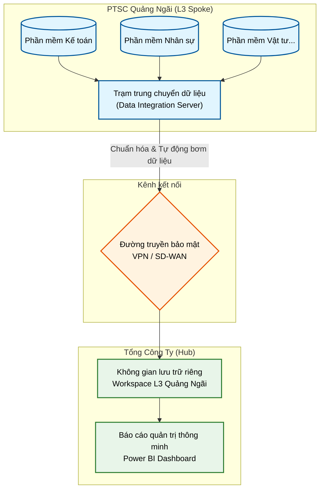
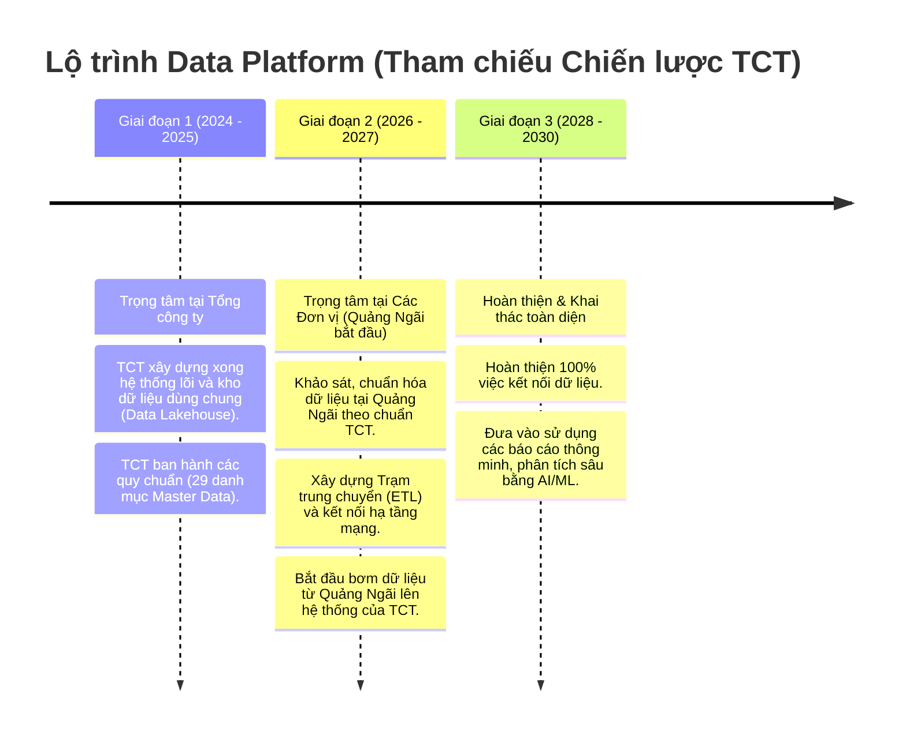

# TỜ TRÌNH / BÁO CÁO BAN GIÁM ĐỐC
**V/v: Kế hoạch triển khai Nền tảng Dữ liệu (Data Platform) tại PTSC Quảng Ngãi**

---

## 1. Căn cứ và Mục tiêu
* **Căn cứ:** Nghị quyết số 10/NQ-HĐQT-PTSC ngày 07/01/2025 về "Chiến lược Chuyển đổi số của Tổng công ty PTSC", trong đó Nền tảng Dữ liệu (Data Platform) là một trụ cột bắt buộc.
* **Mục tiêu:**
  * Đồng bộ hóa dữ liệu của PTSC Quảng Ngãi vào hệ sinh thái dùng chung của Tổng công ty.
  * Hiện đại hóa công tác báo cáo quản trị: Chuyển từ báo cáo Excel thủ công sang báo cáo trực quan tự động (Dashboard) hỗ trợ Ban Giám đốc ra quyết định nhanh chóng, chính xác.
  * Tận dụng tối đa tài nguyên công nghệ đắt tiền (Microsoft Fabric, Power BI) do Tổng công ty đầu tư, giúp PTSC Quảng Ngãi không tốn chi phí xây dựng hạ tầng Data Platform tại đơn vị.

---

## 2. Mô hình triển khai: Vị thế của PTSC Quảng Ngãi
Theo quy hoạch thiết kế của Tổng công ty, mô hình Data Platform áp dụng cấu trúc **Hub-Spoke (Trung tâm - Chi nhánh)**.
* **Tổng công ty (Hub):** Chịu trách nhiệm đầu tư và vận hành các Server lưu trữ khổng lồ (Data Lakehouse) và mua bản quyền phần mềm phân tích đắt tiền.
* **PTSC Quảng Ngãi (L3 Spoke):** Đóng vai trò là một **Trạm trung chuyển dữ liệu**. Chúng ta chỉ cần thiết lập hệ thống để hút dữ liệu từ các phần mềm nội bộ, chuẩn hóa và tự động "bơm" lên một phân vùng không gian riêng (Workspace L3) mà Tổng công ty cấp sẵn cho chúng ta.

### Sơ đồ luồng dữ liệu tổng quan
Dưới đây là sơ đồ minh họa cách dữ liệu chảy từ Quảng Ngãi lên Tổng công ty:

> [!NOTE] 
> Nhìn vào sơ đồ trên, phần màu xanh dương là phạm vi công việc mà đội ngũ PTSC Quảng Ngãi cần thực hiện.

---

## 3. Thực trạng và Thách thức hiện tại
Để đạt được mô hình trên, chúng ta đang đối mặt với một số vấn đề cần giải quyết ngay:
1. **Dữ liệu phân mảnh (Silo):** Chúng ta đang sử dụng nhiều phần mềm nghiệp vụ độc lập. Dữ liệu chưa được tập trung về một mối.
2. **Báo cáo thủ công:** Các phòng ban vẫn mất nhiều thời gian để xuất, tổng hợp và làm báo cáo bằng Excel, dễ dẫn đến độ trễ và sai sót.
3. **Chưa đồng bộ quy chuẩn dữ liệu (Master Data):** Đây là thách thức lớn nhất. Mã nhân sự, mã vật tư, mã hợp đồng... hiện tại của chúng ta có thể đang không khớp với quy chuẩn **"29 danh mục Master Data"** do Tổng công ty ban hành. Chúng ta cần ánh xạ (mapping) lại toàn bộ trước khi có thể truyền dữ liệu lên Tổng công ty.

---

## 4. Lộ trình triển khai theo Chiến lược của Tổng công ty

Theo định hướng Chiến lược Chuyển đổi số của TCT, lộ trình Data Platform được chia thành 3 mốc thời gian cụ thể. Đặc biệt, **năm 2026-2027 hiện tại chính là thời điểm trọng tâm để các đơn vị thành viên (như Quảng Ngãi) thực hiện kết nối**.

---

## 5. Kiến nghị và Đề xuất xin phê duyệt
Để dự án diễn ra đúng tiến độ, bám sát chiến lược của Tổng công ty, Kính trình Ban Giám đốc xem xét và phê duyệt các nội dung sau:

1. **Phê duyệt chủ trương triển khai & Thành lập Tổ công tác Data:**
   * Tổ công tác bao gồm phòng IT (đóng vai trò kỹ thuật) và các Key Users từ các phòng ban nghiệp vụ (đóng vai trò cung cấp hiểu biết về dữ liệu).
   * Giao Tổ công tác phối hợp bắt đầu tiến hành **Giai đoạn 1** (Khảo sát và Ánh xạ dữ liệu Master Data).
2. **Cấp phép tài nguyên hạ tầng:** Cho phép phòng IT được cấp phát 1-2 Máy chủ ảo (VM) tại nội bộ để làm Trạm trung chuyển dữ liệu, và cấu hình đường truyền mạng bảo mật ra Tổng công ty.
3. **Phê duyệt chủ trương ngân sách Thuê ngoài (Nếu cần thiết):** Do công tác xây dựng luồng dữ liệu tự động (ETL) ở Giai đoạn 2 đòi hỏi kỹ năng chuyên sâu về Data Engineering, kính đề xuất Ban Giám đốc cho phép xin báo giá và thuê đối tác ngoài để thực hiện hạng mục này nhằm đảm bảo chất lượng và tiến độ.

**Kính trình Ban Giám đốc xem xét, chỉ đạo!**
