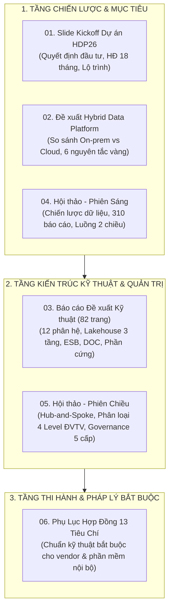

# BÁO CÁO TỔNG HỢP TOÀN CẢNH CHIẾN LƯỢC VÀ KIẾN TRÚC DATA PLATFORM PTSC
## Từ Chiến Lược Tập Đoàn Đến Kế Hoạch Hành Động Tại Đơn Vị Thành Viên (PTSC Quảng Ngãi)

---

### 1. Bức Tranh Toàn Cảnh: Bối Cảnh & Động Lực Chuyển Đổi Số
Tổng công ty Cổ phần Dịch vụ Kỹ thuật Dầu khí Việt Nam (PTSC) đang trong giai đoạn chuyển dịch chiến lược mạnh mẽ từ dịch vụ dầu khí truyền thống sang các lĩnh vực năng lượng tái tạo ngoài khơi (Offshore Wind), công nghiệp cơ khí siêu trường siêu trọng và logistics cảng biển.
* **Thách thức cốt lõi:** Dữ liệu toàn tập đoàn đang phân mảnh trên hơn **310 danh mục báo cáo**, chủ yếu xử lý qua các file Excel trên SharePoint/OneDrive, thiếu hệ thống dữ liệu chủ (Master Data) đồng nhất, gây lãng phí hàng nghìn giờ công lao động mỗi tháng và làm chậm trễ các quyết định điều hành tác chiến.
* **Chiến lược "Data First" (2024 - 2035):** Xác định dữ liệu là tài sản số vô giá. Dự án Nền tảng Dữ liệu Hợp nhất (**Hybrid Data Platform - Mã dự án HDP26**) ra đời nhằm xây dựng "một nguồn sự thật duy nhất" (Single Source of Truth - SSOT), kết nối toàn bộ Cơ quan Tổng công ty (CQTCT) và 17 Đơn vị Thành viên (ĐVTV).

---

### 2. Tổng Hợp Ma Trận 6 Tài Liệu Cốt Lõi Của Tổng Công Ty

Toàn bộ tài liệu trong thư mục `TCT` tạo thành một hệ thống văn kiện chuyển đổi số hoàn chỉnh, logic từ chiến lược đến pháp lý và kỹ thuật:

* **Tài liệu 01 (Kickoff HDP26):** Công bố tính pháp lý và khởi động triển khai thực tế giữa PTSC và Liên danh HiPT - AITS (04/03/2026 - 27/08/2027), xác định CQTCT làm hạt nhân trong 6 tháng đầu và PTSC Quảng Ngãi là đơn vị trọng điểm mở rộng trong giai đoạn tiếp theo.
* **Tài liệu 02 (Chiến lược Hybrid Data Platform):** Luận giải tại sao PTSC chọn kiến trúc **Multi-site Multi-cloud** kết hợp On-premise Data Center (bảo vệ an ninh dữ liệu nội bộ và tối ưu TCO) với Public Cloud (linh hoạt mở rộng phân tích nâng cao, AI Text-to-Data).
* **Tài liệu 03 (Đề xuất Kỹ thuật 82 trang):** Bản thiết kế chi tiết toàn bộ "cỗ máy" Data Platform với 12 phân hệ chức năng, kiến trúc Datalakehouse 3 phân vùng (Landing / Standardized / Curated), chuẩn mã hóa bảo mật ISO 27001 và hệ thống mạng chuyên dụng.
* **Tài liệu 04 (Hội thảo Phiên Sáng):** Định vị nguyên tắc "chia sẻ dữ liệu hai chiều" - ĐVTV bơm dữ liệu sản xuất thô lên TCT, TCT hoàn trả Master Data chuẩn, dữ liệu so sánh chuẩn ngành (Benchmarking) và Dashboard điều hành thông minh.
* **Tài liệu 05 (Hội thảo Phiên Chiều):** Thiết lập mô hình **Hub-and-Spoke** phân nhóm 17 ĐVTV, xác định PTSC Quảng Ngãi nằm ở nhóm **Spoke Level 3**, cơ chế Quản trị Dữ liệu 5 cấp độ (5-Level Data Governance) và 7 cấu phần chi phí đầu tư.
* **Tài liệu 06 (Phụ lục Hợp đồng 13 Tiêu chí):** "Thước đo kỹ thuật và vũ khí pháp lý" bắt buộc mọi phần mềm và nhà cung cấp (Vendor) phải tuân thủ để kết nối vào Data Platform.

---

### 3. Khung Kiến Trúc Công Nghệ & Quản Trị Hợp Nhất

#### A. Kiến Trúc Dữ Liệu 3 Tầng (Medallion Datalakehouse)
1. **Landing Zone (Bronze):** Hút dữ liệu nguyên bản từ các phần mềm nội bộ (FAST, HRM, SCADA...), lưu trữ bất biến (Immutable), nén dạng Parquet/Object Storage.
2. **Standardized Zone (Silver):** Làm sạch lỗi encoding UTF-8, chuẩn hóa kiểu dữ liệu, loại bỏ trùng lặp và tách bản ghi lỗi vào bảng cách ly (Quarantine).
3. **Curated Zone (Gold):** Mô hình hóa theo chuẩn Star Schema (Fact/Dimension) phục vụ trực tiếp cho Power BI, Apache Superset và Trung tâm Vận hành DOC.

#### B. Mô Hình Hub-and-Spoke & Vị Thế Của PTSC Quảng Ngãi
* **Hub (Trung tâm TCT):** Điều phối toàn mạng lưới, quản lý Master Data (MDM), quản lý quyền truy cập tập trung (IAM Keycloak) và lưu trữ dữ liệu hợp nhất.
* **Spoke Level 3 (PTSC Quảng Ngãi):** Thiết lập cổng kết nối Edge Gateway/Agent nội bộ, hút dữ liệu từ CSDL cục bộ và đẩy an toàn qua đường hầm **IPSec VPN** về phân vùng Tenant riêng của Quảng Ngãi trên Hub TCT.
* **Khả năng nâng cấp:** Khi quy mô khối lượng dữ liệu gia công chế tạo và cảng biển tăng trưởng mạnh, Quảng Ngãi hoàn toàn có thể nâng cấp thành cụm **Spoke Level 2** (có lưu trữ dữ liệu tại chỗ độc lập) mà không bị xung đột kiến trúc.

#### C. Cơ Chế Quản Trị Dữ Liệu 5 Cấp Độ (Data Governance Framework)
* **Cấp 1 & 2 (TCT):** Hội đồng Quản trị Dữ liệu (PTGĐ Phạm Văn Hùng) & Ban Quản trị Dữ liệu (Nguyễn Đức Thiện) ban hành chính sách và tiêu chuẩn dữ liệu toàn tập đoàn.
* **Cấp 3 - Chủ quản Dữ liệu (Data Owner):** Ban Giám đốc PTSC Quảng Ngãi phê duyệt phạm vi dữ liệu chia sẻ và bảo mật.
* **Cấp 4 - Người quản lý Nghiệp vụ (Data Stewards):** Các Trưởng/Phó phòng Kế toán, Nhân sự, Dự án, Cảng biển của Quảng Ngãi chịu trách nhiệm định nghĩa nghiệp vụ và chất lượng số liệu.
* **Cấp 5 - Đội ngũ Kỹ thuật (Data Custodians):** Tổ CNTT Quảng Ngãi trực tiếp cấu hình hạ tầng mạng, máy chủ Gateway, sao lưu và bảo mật.

---

### 4. Định Vị Hành Động Chiến Lược Cho PTSC Quảng Ngãi

Từ việc thấu hiểu toàn diện các văn bản của TCT, PTSC Quảng Ngãi cần thực thi ngay 4 nhóm nhiệm vụ trọng tâm:

1. **Về Mặt Tổ Chức & Pháp Lý:**
   * Ban hành Quyết định thành lập Tổ công tác Data Platform tại PTSC Quảng Ngãi, phân vai rõ ràng theo mô hình 5 Cấp độ (Data Owner, Data Stewards, Data Custodians).
   * Đưa biểu mẫu **Phụ lục 13 Tiêu chí Kỹ thuật (PTSC-ADM-RG08-FM10)** vào tất cả các hồ sơ mời thầu, hợp đồng mua sắm và bảo trì phần mềm CNTT.
2. **Về Mặt Kỹ Thuật & Khảo Sát Hệ Thống:**
   * Rà soát hiện trạng CSDL phần mềm FAST Accounting và phần mềm Quản trị Nhân sự: Kiểm tra tính sẵn sàng của các cột mốc thời gian (`updated_at`, `created_at`) để áp dụng cơ chế trích xuất dữ liệu mới (CDC/Batch) mà không cần tốn tiền thuê vendor viết lại API.
   * Lập bảng Từ điển dữ liệu (Data Dictionary) và Sơ đồ quan hệ thực thể (ERD) cho các bảng giao dịch chính.
3. **Về Mặt Hạ Tầng & An Toàn Thông Tin:**
   * Phối hợp với Phòng CNTT TCT (anh Nguyễn Văn Minh) để thiết lập và kiểm thử đường truyền mạng số liệu chuyên dùng kết hợp đường hầm bảo mật **IPSec VPN Site-to-Site**.
   * Chuẩn bị 01 máy chủ ảo hóa (hoặc máy chủ vật lý) đóng vai trò Gateway/Agent trung chuyển dữ liệu tại Quảng Ngãi.
4. **Về Kế Hoạch Báo Cáo & Phản Hồi TCT:**
   * Soạn thảo một báo cáo nghiên cứu chính thức, trang trọng gửi Ban Quản trị Dự án TCT (anh Nguyễn Đức Thiện) và Tổ Dữ liệu (anh Nguyễn Văn Phát).
   * Thể hiện rõ PTSC Quảng Ngãi đã làm chủ kiến trúc TCT, đồng thời chủ động đề xuất giải pháp kỹ thuật, cơ chế phối hợp và kiến nghị TCT hỗ trợ tài nguyên, bản quyền phần mềm.
