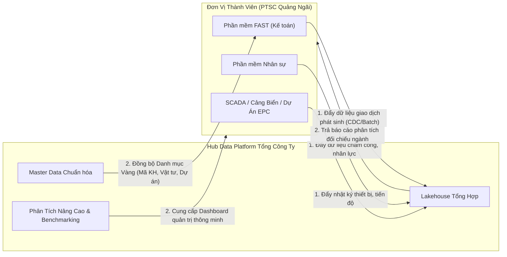

# BÁO CÁO RÀ SOÁT TÀI LIỆU TCT SỐ 04
## Tên tài liệu: Slide Hội Thao Data Platform - Phiên Sáng (Chiến Lược Dữ Liệu PTSC)
* **Tên file gốc:** `20260810_Slide_Hoi thao Data Platform_Phien Sang.pdf` (48 trang)
* **Thời gian tổ chức:** Ngày 10 tháng 08 năm 2026.
* **Mục tiêu phiên sáng:** Quán triệt định hướng chiến lược dữ liệu toàn Tổng công ty, phân tích 6 mục tiêu cụ thể, công bố hiện trạng 310 danh mục báo cáo, và làm rõ nguyên tắc chia sẻ dữ liệu hai chiều giữa Cơ quan Tổng công ty (CQTCT) và các Đơn vị Thành viên (ĐVTV).

---

### 1. Sáu Mục Tiêu Trọng Tâm Của Nền Tảng Dữ Liệu PTSC
TCT xác định 6 mục tiêu chiến lược mà Dự án Data Platform bắt buộc phải hiện thực hóa:
1. **Hợp nhất và liên thông dữ liệu toàn diện:** Phá vỡ các "ốc đảo dữ liệu" (Data Silos) tại CQTCT và giữa các ĐVTV; tạo lập một bức tranh dữ liệu tổng thể và thông suốt.
2. **Xây dựng kiến trúc hiện đại - tối ưu TCO:** Ứng dụng mô hình Datalakehouse Hybrid Multi-cloud nhằm kết hợp sức mạnh xử lý quy mô lớn với bài toán tối ưu chi phí đầu tư dài hạn.
3. **Thiết lập chuẩn quản trị dữ liệu (Data Governance & MDM):** Ban hành khung chuẩn hóa dữ liệu danh mục chủ (Khách hàng, Vật tư, Nhân sự, Tài sản) để tất cả các đơn vị cùng "nói chung một ngôn ngữ dữ liệu".
4. **Vận hành Trung tâm Điều hành Dữ liệu (DOC) thời gian thực:** Cung cấp cho Ban lãnh đạo TCT và lãnh đạo ĐVTV các bảng chỉ số điều hành (Dashboards/KPIs) tức thời, chính xác, thay thế báo cáo giấy và báo cáo tổng hợp thủ công.
5. **Dân chủ hóa dữ liệu (Self-service Analytics & AI):** Trao quyền cho các kỹ sư, chuyên viên nghiệp vụ tự truy vấn dữ liệu an toàn phục vụ phân tích sản xuất, dự báo kỹ thuật và ứng dụng AI (Text-to-Data).
6. **Bảo đảm an toàn thông tin và tuân thủ pháp lý:** Đáp ứng nghiêm ngặt các quy định pháp luật Việt Nam (Luật An ninh mạng, Nghị định 13/2023/NĐ-CP, Nghị định 53/2022/NĐ-CP) và tiêu chuẩn an toàn ISO 27001.

---

### 2. Hiện Trạng Dữ Liệu & "Nỗi Đau" 310 Báo Cáo
* **Thống kê thực tế:** Toàn Tổng công ty hiện có tới **310 biểu mẫu báo cáo định kỳ**, phục vụ các khối nghiệp vụ: Tài chính Kế toán, Thương mại, Kỹ thuật Dự án EPC, Quản lý Cảng biển & Đội tàu, An toàn - Sức khỏe - Môi trường (HSE), Quản trị Nhân sự.
* **Hậu quả của phân mảnh dữ liệu:**
  * Mỗi phòng ban hoặc ĐVTV tự xử lý số liệu theo định dạng riêng.
  * Tốn hàng nghìn giờ công lao động mỗi tháng chỉ để tổng hợp, đối soát và làm sạch dữ liệu thủ công qua Excel.
  * Tình trạng "độ trễ dữ liệu": Khi báo cáo đến tay Lãnh đạo thì số liệu đã chậm từ vài ngày đến vài tuần, không còn giá trị điều hành tác chiến kịp thời.

---

### 3. Trục Tích Hợp (ESB) - "Trái Tim" Kết Nối Giữa TCT & ĐVTV
* **Tầm quan trọng sống còn của ESB:** Tài liệu nhấn mạnh rằng thách thức lớn nhất của một tập đoàn quy mô lớn không nằm ở chỗ lưu trữ được bao nhiêu Petabyte, mà nằm ở chỗ **làm thế nào để các phần mềm cũ và mới có thể "nói chuyện" được với nhau**.
* **Cơ chế hoạt động:**
  * Thay vì xây dựng các kết nối "điểm - điểm" (Point-to-Point) chằng chịt, phức tạp và dễ gãy vỡ, toàn bộ phần mềm của TCT và các ĐVTV sẽ cắm vào một Trục tích hợp dịch vụ doanh nghiệp (ESB) duy nhất.
  * Hỗ trợ cơ chế đẩy nhận thông điệp qua Kafka, đảm bảo khi một hệ thống nguồn bị ngắt mạng tạm thời thì dữ liệu vẫn được xếp hàng đợi (Message Queue) an toàn, không bị thất thoát.

---

### 4. Cơ Chế Chia Sẻ Dữ Liệu Hai Chiều (Bidirectional Flow)
Tài liệu định vị rõ: Data Platform của TCT không phải là công cụ "hút dữ liệu một chiều" của ĐVTV, mà là **nền tảng cộng tác đôi bên cùng có lợi**:

* **Chiều đẩy lên (ĐVTV → TCT):** ĐVTV truyền dữ liệu vận hành thô (giao dịch kế toán, tiến độ dự án, giờ công nhân sự, định vị tài sản) về Hub TCT để phục vụ báo cáo hợp nhất toàn tập đoàn.
* **Chiều trả về (TCT → ĐVTV):** TCT cung cấp ngược lại:
  * Bộ dữ liệu Master Data chuẩn hóa (giúp ĐVTV không phải tự nhập mã rác).
  * Các báo cáo phân tích so sánh năng suất chuẩn ngành (Benchmarking) giữa các ĐVTV.
  * Bảng điều hành quản trị dành riêng cho Ban Giám đốc Đơn vị Thành viên.

---

### 5. Ý Nghĩa & Khuyến Nghị Cho PTSC Quảng Ngãi
1. **Hiểu đúng bản chất dự án:** Dự án Data Platform không làm xáo trộn các phần mềm hiện hữu tại Quảng Ngãi (không thay thế FAST hay phần mềm nội bộ), mà trang bị thêm "cầu nối" để số liệu tự động chảy lên TCT và nhận lại báo cáo cấp cao.
2. **Cơ hội rà soát 310 báo cáo:** Đội ngũ nghiệp vụ PTSC Quảng Ngãi cần lọc ra danh mục các báo cáo định kỳ đang phải gửi về TCT để đưa vào danh sách tự động hóa ngay từ đầu.
3. **Sự chủ động về Trục tích hợp:** Để cắm được vào ESB của TCT, hệ thống IT của Quảng Ngãi cần sẵn sàng mở cổng API hoặc phân quyền kết nối CSDL theo đúng chuẩn kỹ thuật của Ban Dự án TCT.
