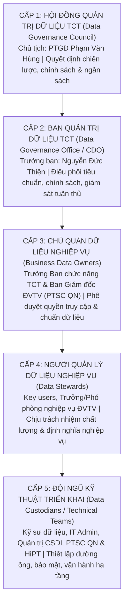

# BÁO CÁO RÀ SOÁT TÀI LIỆU TCT SỐ 05
## Tên tài liệu: Slide Hội Thao Data Platform - Phiên Chiều (Kiến Trúc Kỹ Thuật, Mô Hình Hub-Spoke & Quản Trị Dữ Liệu)
* **Tên file gốc:** `20260810_Slide_Hoi thao Data Platform_Phien Chieu.pdf` (63 trang)
* **Thời gian tổ chức:** Ngày 10 tháng 08 năm 2026 (Phiên chiều).
* **Mục tiêu phiên chiều:** Đi sâu vào phương án kỹ thuật chi tiết: Kiến trúc Hub-and-Spoke, phân loại 4 nhóm Đơn vị Thành viên (ĐVTV), cơ chế phân cấp Quản trị dữ liệu 5 cấp độ (5-Level Governance), 7 cấu phần chi phí đầu tư và lộ trình kỹ thuật triển khai cho ĐVTV.

---

### 1. Mô Hình Kiến Trúc Hub-and-Spoke & Phân Nhóm Đơn Vị Thành Viên
TCT lựa chọn mô hình kiến trúc phân tán **Hub-and-Spoke** để cân bằng giữa tính tập trung điều hành của TCT và tính chủ động tác nghiệp của các ĐVTV:
* **Trung tâm (Hub):** Đặt tại CQTCT (PetroVietnam Tower, TP.HCM), chịu trách nhiệm điều phối dữ liệu tổng thể, quản lý dữ liệu chủ (MDM), danh mục dữ liệu (Data Catalog), phân quyền tập trung và vận hành Trung tâm DOC.
* **Đơn vị Vệ tinh (Spoke):** Đặt tại các Đơn vị Thành viên, có nhiệm vụ thu thập, xử lý cục bộ và đồng bộ dữ liệu về Hub theo chuẩn giao tiếp chung.
* **Phân cấp 17 Đơn vị Thành viên PTSC theo 4 Level:**

| Cấp Độ Triển Khai | Đặc Điểm Hệ Thống & Quy Mô | Phương Án Kỹ Thuật Áp Dụng | Vị Trí Của PTSC Quảng Ngãi |
| :--- | :--- | :--- | :--- |
| **Spoke Level 1** | Đơn vị quy mô cực lớn, có trung tâm dữ liệu riêng, nhiều phần mềm phức tạp (PTSC M&C, PTSC Marine, POS). | Triển khai cụm Spoke Data Platform độc lập tại chỗ; đồng bộ dữ liệu chọn lọc về Hub TCT. | |
| **Spoke Level 2** | Đơn vị có quy mô lớn, hạ tầng máy chủ nội bộ khá, hệ sinh thái ứng dụng đang mở rộng. | Triển khai cụm Spoke rút gọn, lưu trữ dữ liệu tại chỗ kết hợp cổng API Gateway đẩy về Hub. | |
| **Spoke Level 3** | **Đơn vị quy mô vừa, có các phần mềm nghiệp vụ cốt lõi riêng (FAST, HRM, SCADA, Quản lý Cảng/Xưởng).** | **Thu thập dữ liệu cục bộ qua cổng Agent/Gateway nội bộ và đẩy thẳng về phân vùng Tenant riêng trên Hub TCT.** | **👉 PTSC Quảng Ngãi thuộc nhóm này (với lộ trình tiến tới Spoke Level 2 khi mở rộng quy mô).** |
| **Level 4 (Tenant thuần túy)** | Đơn vị quy mô nhỏ, chi nhánh, văn phòng đại diện, không có hạ tầng IT riêng. | Sử dụng trực tiếp hạ tầng phần mềm dùng chung của TCT (Multi-tenant) qua mạng Internet an toàn. | |

---

### 2. Mô Hình Phân Cấp Quản Trị Dữ Liệu 5 Cấp Độ (5 Levels of Data Governance)
Để đảm bảo dữ liệu "Đúng - Đủ - Sạch - Sống", TCT thiết lập cơ chế quản trị 5 cấp gồm **4 cấp điều hành chiến lược** và **1 cấp triển khai kỹ thuật**:

* **Ý nghĩa đối với ĐVTV:** PTSC Quảng Ngãi cần chỉ định rõ:
  * **Data Owner (Chủ quản):** Thành viên Ban Giám đốc phụ trách Kỹ thuật / CĐS.
  * **Data Stewards (Quản lý nghiệp vụ):** Các Trưởng/Phó phòng Kế toán, Tổ chức Nhân sự, Dự án, Cảng biển.
  * **Data Custodians (Kỹ thuật):** Tổ CNTT chịu trách nhiệm sao lưu, bảo mật và vận hành đường truyền kết nối.

---

### 3. Bảy Cấu Phần Chi Phí Của Dự Án & Cơ Chế Đầu Tư Kết Hợp
TCT phân tích rõ 7 cấu phần chi phí để các đơn vị chủ động lập kế hoạch ngân sách:
1. **Chi phí Bản quyền Phần mềm Nền tảng (Platform License):** Bản quyền công cụ Lakehouse, CDC, Trục tích hợp, Data Catalog (TCT chịu trách nhiệm mua tập trung gói lớn để tối ưu chiết khấu).
2. **Chi phí Hạ tầng Máy chủ & Lưu trữ (Hardware / Storage / Cloud):** Máy chủ vật lý, tủ đĩa SAN, thiết bị mạng tại Trung tâm điều hành TCT và máy chủ Gateway tại ĐVTV.
3. **Chi phí Tích hợp Hệ thống Nguồn (Vendor Integration Cost):** Chi phí thuê các nhà cung cấp phần mềm hiện hữu (như FAST Software) mở cổng API hoặc phân quyền kết nối trích xuất CSDL.
4. **Chi phí Mạng truyền thông & An toàn thông tin:** Đường truyền số liệu chuyên dùng (MPLS WAN), thiết bị Firewall, chứng chỉ bảo mật SSL/TLS.
5. **Chi phí Dịch vụ Triển khai Kỹ thuật:** Thuê liên danh chuyên gia HiPT - AITS xây dựng các luồng dữ liệu (Data Pipelines) và mô hình hóa bảng dữ liệu.
6. **Chi phí Đào tạo & Chuyển giao Năng lực:** Đào tạo văn hóa dữ liệu cho cán bộ nghiệp vụ và chuyển giao công nghệ cho đội ngũ IT của TCT và ĐVTV.
7. **Chi phí Bảo trì, Nâng cấp & Vận hành Hàng năm (OPEX):** Duy trì dịch vụ hỗ trợ kỹ thuật 24/7 của nhà thầu và chi phí bản quyền điện toán đám mây.

* **Cơ chế phân bổ đầu tư TCT - ĐVTV:**
  * **TCT đầu tư:** Toàn bộ hạ tầng Hub trung tâm, nền tảng lõi Data Platform, DOC và bản quyền dùng chung.
  * **ĐVTV đầu tư:** Hạ tầng máy chủ Gateway cục bộ tại đơn vị, đường truyền VPN về TCT, và chi phí thuê vendor nội bộ mở cổng dữ liệu.

---

### 4. Ý Nghĩa & Khuyến Nghị Trọng Tâm Cho PTSC Quảng Ngãi
1. **Khẳng định vị thế Spoke Level 3:** Quảng Ngãi không phải xây dựng một hệ thống Data Platform cồng kềnh tốn kém từ đầu, mà tập trung thiết lập một trạm thu gom và gateway kết nối an toàn với Hub của TCT.
2. **Thành lập ngay Bộ máy Quản trị Dữ liệu 5 Cấp tại đơn vị:** Phải giao trách nhiệm cụ thể cho các phòng ban nghiệp vụ (Kế toán, Nhân sự, Xưởng đóng mới, Cảng) làm Data Stewards, không thể phó mặc toàn bộ cho một mình bộ phận CNTT.
3. **Dự toán ngân sách chính xác:** Cần đưa ngay chi phí làm việc với Vendor FAST và hạ tầng mạng vào kế hoạch ngân sách công nghệ thông tin năm 2026 của PTSC Quảng Ngãi.
