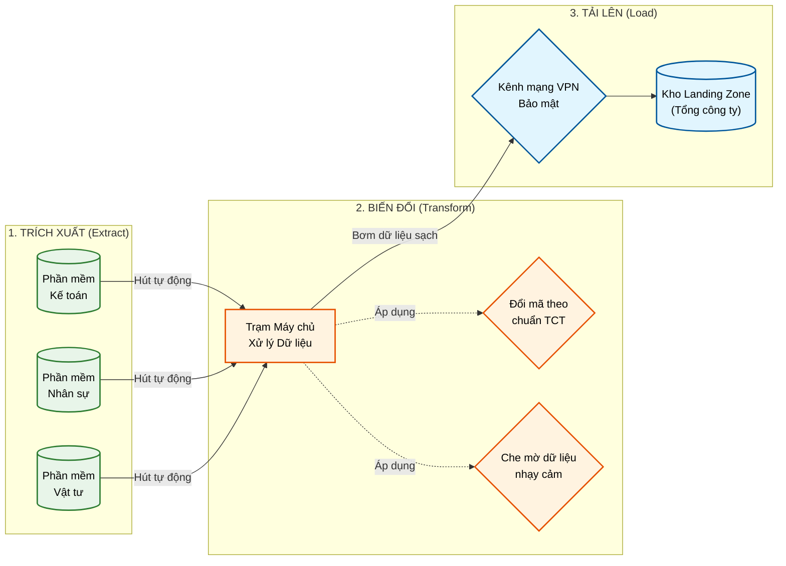

# KẾ HOẠCH HÀNH ĐỘNG CHI TIẾT - GIAI ĐOẠN 2 (Trọng điểm)
**Trọng tâm: Xây dựng Trạm trung chuyển dữ liệu (Data Integration Gateway / ETL)**

Đây là giai đoạn cốt lõi của PTSC Quảng Ngãi trong năm 2026-2027. Giai đoạn này nặng về kỹ thuật (Data Engineering, Network).

## 1. Mục tiêu
* Xây dựng thành công "đường ống" tự động (Pipeline) để hút dữ liệu, dịch mã (theo bảng ánh xạ ở GĐ 1) và bơm lên Landing Zone của Tổng công ty.
* Đảm bảo tính bảo mật và vận hành ổn định tự động hàng ngày.

**Sơ đồ luồng xử lý dữ liệu (ETL Pipeline):**

## 2. Nhân sự tham gia
* **Đội IT Quảng Ngãi:** Phụ trách hạ tầng, mạng và giám sát nhà thầu.
* **Đối tác bên ngoài (Vendor):** *(Khuyến nghị)* Tham gia code và thiết lập hệ thống ETL/Data Pipeline nếu IT nội bộ chưa có chuyên môn về Data.
* **IT Tổng công ty:** Phối hợp thiết lập VPN và mở cổng tường lửa.

## 3. Các bước thực hiện cụ thể

### Bước 2.1: Triển khai Hạ tầng mạng & Bảo mật (Cấp "đất" xây trạm)
* IT nội bộ tạo 1-2 Máy chủ ảo (Virtual Machine) chuyên dụng, cấp CPU và RAM phù hợp (Ví dụ: 8 Core, 16GB RAM).
* Đặt máy chủ này vào phân vùng mạng `Internal Service Zone` (để tránh bị tấn công mạng).
* Thiết lập đường hầm bảo mật (VPN Site-to-Site hoặc SD-WAN) mã hóa nối thẳng từ máy chủ này tới Datacenter của TCT.

### Bước 2.2: Triển khai công cụ Tích hợp dữ liệu (Lắp "máy bơm")
* Cài đặt nền tảng ETL lên máy chủ vừa tạo. Các nền tảng mã nguồn mở khuyên dùng: **Airbyte** (để hút dữ liệu dễ dàng), **dbt** (để biến đổi dữ liệu), hoặc **Apache Airflow** (để lên lịch).
* Cấu hình kết nối (Connector) từ công cụ ETL vào các Database nội bộ (Kế toán, Nhân sự...).

### Bước 2.3: Xây dựng luồng xử lý dữ liệu (Lắp "ống dẫn & màng lọc")
* Lập trình viên viết các luồng (Data Pipeline) thực hiện 3 bước E-T-L:
  * **E (Extract):** Hút dữ liệu thô mới phát sinh trong ngày về máy chủ ETL.
  * **T (Transform):** 
    * *Dịch mã:* Gắn Bảng ánh xạ (GĐ 1) vào để đổi mã Quảng Ngãi thành mã TCT.
    * *Che mờ (Masking):* Chạy thuật toán băm/xóa các cột nhạy cảm.
  * **L (Load):** Đẩy dữ liệu sạch lên Workspace L3 hoặc Landing Zone của TCT.

### Bước 2.4: Vận hành và Giám sát tự động
* Thiết lập Lập lịch (Scheduler): Cấu hình hệ thống cứ 23:00 đêm hàng ngày tự động kích hoạt quá trình hút-đẩy.
* Thiết lập cảnh báo (Alerts): Nếu đêm nào hút lỗi, đứt mạng, dữ liệu bị sai định dạng -> Hệ thống tự động bắn tin nhắn báo lỗi qua Email/Zalo/Telegram cho IT Quảng Ngãi.

## 4. Kết quả cần đạt (Deliverables)
* [ ] Hệ thống máy chủ ETL hoạt động ổn định.
* [ ] Cấu hình xong VPN Site-to-Site.
* [ ] Các luồng dữ liệu tự động chạy thành công ít nhất 1 tháng không phát sinh lỗi nghiêm trọng.
