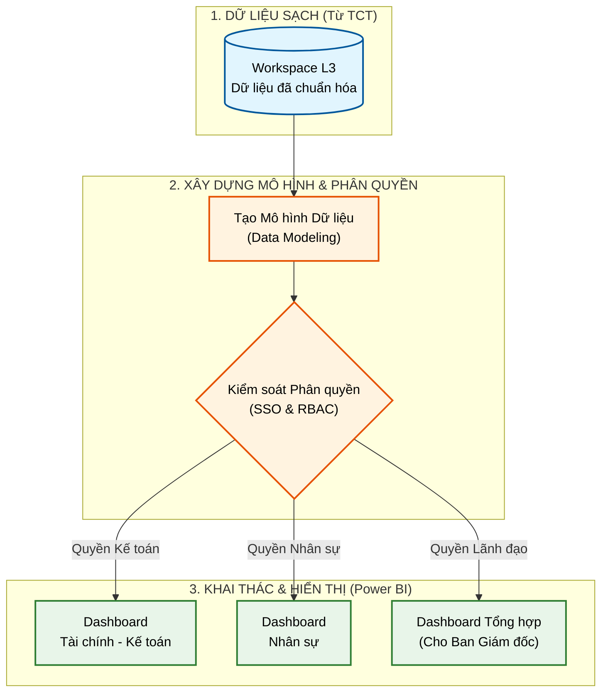

# KẾ HOẠCH HÀNH ĐỘNG CHI TIẾT - GIAI ĐOẠN 3
**Trọng tâm: Phân quyền và Khai thác báo cáo thông minh (Power BI Dashboard)**

Sau khi Giai đoạn 1 và 2 hoàn tất (Dữ liệu đã nằm gọn gàng trên kho của Tổng công ty), đây là lúc PTSC Quảng Ngãi "hái quả" - sử dụng dữ liệu để phục vụ điều hành kinh doanh.

## 1. Mục tiêu
* Quản trị an toàn quyền truy cập (không để lộ lọt báo cáo cho người không có thẩm quyền).
* Xây dựng các Dashboard báo cáo trực quan cho Lãnh đạo thay thế báo cáo Excel thủ công.

**Sơ đồ luồng khai thác báo cáo (Data Exploitation):**

## 2. Nhân sự tham gia
* **Business Users (Người dùng nghiệp vụ):** Các nhân viên phân tích, quản lý phòng ban.
* **Ban Giám đốc:** Người xem báo cáo cuối cùng.
* **IT:** Hỗ trợ cấp phát tài khoản.

## 3. Các bước thực hiện cụ thể

### Bước 3.1: Tiếp nhận hạ tầng và Thiết lập tài khoản (IAM/SSO)
* Làm việc với IT Tổng công ty để triển khai cơ chế **Đăng nhập một lần (Single Sign-On - SSO)**. 
  * *Ví dụ: Nhân viên Quảng Ngãi dùng email `@ptsc.com.vn` đang dùng hàng ngày có thể đăng nhập thẳng vào hệ thống báo cáo (Microsoft Fabric/Power BI).*
* Tiếp nhận quyền quản trị cao nhất đối với **Workspace L3** (Vùng không gian riêng của Quảng Ngãi).

### Bước 3.2: Phân quyền nội bộ (RBAC - Role Based Access Control)
* IT Quảng Ngãi tiến hành phân quyền chặt chẽ theo chức vụ:
  * Lãnh đạo cấp cao: Được xem toàn bộ Dashboard tổng hợp.
  * Trưởng phòng Nhân sự: Chỉ được xem Dashboard nhân sự.
  * Trưởng phòng Kế toán: Chỉ được xem Dashboard tài chính.
* Tuyệt đối không cấp quyền xem dữ liệu chéo nhau nếu không có sự phê duyệt.

### Bước 3.3: Thiết kế mô hình dữ liệu & Vẽ Dashboard (Data Visualization)
* Các chuyên viên Data (hoặc đối tác) truy cập vào Microsoft Fabric, kéo thả các dữ liệu đã được làm sạch để dựng các Mô hình dữ liệu (Data Modeling - Star Schema).
* Thiết kế các Dashboard bằng công cụ **Power BI**:
  * Dashboard Doanh thu / Chi phí.
  * Dashboard Tiến độ dự án.
  * Dashboard Quản lý kho, tồn kho.
  * Dashboard Biến động nhân sự.
* *Lợi ích:* Báo cáo này tự động cập nhật số liệu mới nhất mỗi ngày (do máy bơm ở Giai đoạn 2 chạy ban đêm), sáng hôm sau Lãnh đạo mở điện thoại ra là có số mới.

### Bước 3.4: Đào tạo chuyển giao (Training & Data Literacy)
* Tổ chức các buổi hướng dẫn sử dụng Power BI cho nhân sự các phòng ban (để họ tự kéo thả làm báo cáo nhỏ cho riêng mình - Self-service BI).
* Hướng dẫn Ban Giám đốc cài đặt app Power BI trên điện thoại di động/iPad để xem báo cáo mọi lúc mọi nơi.

## 4. Kết quả cần đạt (Deliverables)
* [ ] Hệ thống phân quyền tài khoản hoạt động trơn tru.
* [ ] Hoàn thiện và nghiệm thu các bộ Dashboard báo cáo quản trị trọng yếu.
* [ ] 100% người dùng liên quan được đào tạo và sử dụng thành thạo hệ thống.
