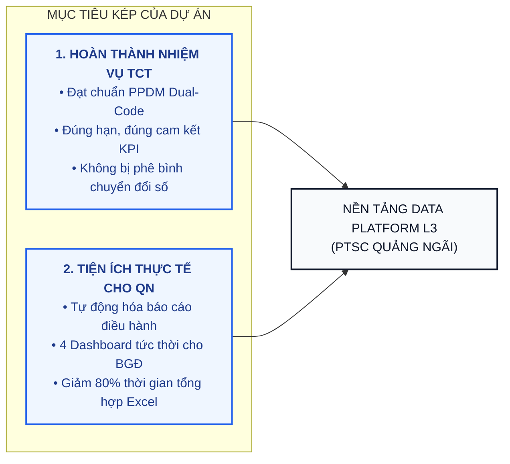
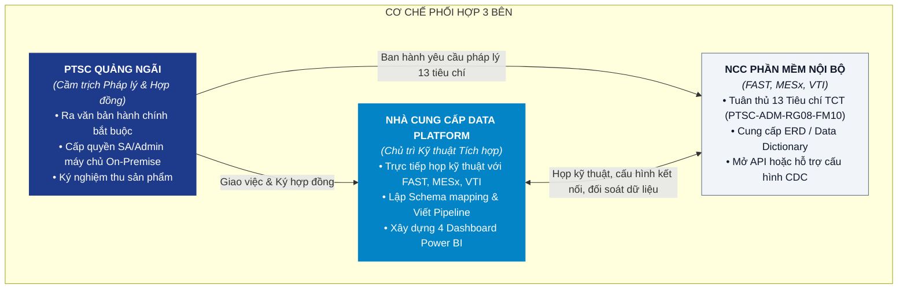
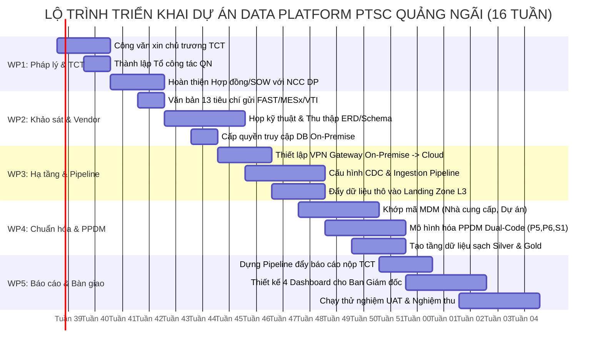

# TỜ TRÌNH & KẾ HOẠCH HÀNH ĐỘNG TRIỂN KHAI NỀN TẢNG DỮ LIỆU (DATA PLATFORM) TẠI PTSC QUẢNG NGÃI

> **Kính trình:** Ban Giám đốc Công ty Cổ phần Dịch vụ Dầu khí Quảng Ngãi (PTSC Quảng Ngãi)  
> **Đơn vị soạn thảo:** Phòng Công nghệ Thông tin phối hợp cùng các Phòng ban/Xí nghiệp  
> **Tài liệu kỹ thuật tham chiếu:** [kien_truc_data_platform_chi_tiet.md](file:///d:/Data-Platform/kien_truc_data_platform_chi_tiet.md)  
> **Thời gian:** Tháng 09/2026  

---

## TÓM TẮT ĐIỀU HÀNH (EXECUTIVE SUMMARY)

Báo cáo này cụ thể hóa chủ trương của Tổng công ty PTSC về việc triển khai Nền tảng Dữ liệu (Data Platform) tập trung thành **Kế hoạch hành động chi tiết (Action Plan) tại PTSC Quảng Ngãi**, giải quyết 4 vấn đề cốt lõi mà Ban Giám đốc quan tâm:

1. **Mục tiêu chính trị & Nhiệm vụ TCT giao:** Đảm bảo PTSC Quảng Ngãi hoàn thành đúng hạn 100% các tiêu chí tích hợp dữ liệu của TCT theo mô hình **Level 3 (Tenant riêng trên Cloud Microsoft Fabric)**; dữ liệu được phân quyền cô lập tuyệt đối, TCT và các đơn vị bạn không thể xem dữ liệu chi tiết nội bộ của Quảng Ngãi.
2. **Không phát sinh chi phí mua sắm phần cứng (CAPEX = 0 đồng):** Toàn bộ máy chủ tính toán, lưu trữ OneLake và bản quyền phần mềm phân tích hiện đại đều do Tổng công ty đầu tư và cấp phát.
3. **Chiến lược đối tác triển khai:** Đề xuất làm việc với **chính Nhà cung cấp (Vendor) đang triển khai Data Platform cho Tổng công ty** để triển khai luôn cho Quảng Ngãi. Phương án này triệt tiêu 80% rủi ro kỹ thuật, đảm bảo tương thích kiến trúc 100% và rút ngắn 2 tháng thời gian triển khai.
4. **Lợi ích thiết thực cho Lãnh đạo:** Tận dụng dự án để tự động hóa số liệu điều hành, trang bị cho Ban Giám đốc **4 màn hình Dashboard trực quan** (Tiến độ xưởng cơ khí Dung Quất, Hiệu suất khai thác Cảng Dung Quất & đội tàu, Dòng tiền dự án, An toàn lao động).

---

## PHẦN I: BỐI CẢNH, CĂN CỨ PHÁP LÝ & VỊ THẾ CỦA QUẢNG NGÃI

### 1. Căn cứ pháp lý
* **Nghị quyết số 10/NQ-HĐQT-PTSC** về "Chiến lược Chuyển đổi số của Tổng công ty PTSC giai đoạn 2026–2030", xác định Data Platform là nền tảng sống còn.
* **Quy chế Quản trị Dữ liệu số 889/QC-PTSC** do Tổng công ty ban hành.
* **Văn bản biểu mẫu PTSC-ADM-RG08-FM10:** *"Phụ lục về yêu cầu tích hợp Data Platform"* ban hành 13 tiêu chí kỹ thuật bắt buộc cho toàn bộ hệ sinh thái phần mềm.
* **Kết luận Hội thảo Data Platform TCT (Tháng 08/2026):** Phân tầng kiến trúc Hub-and-Spoke, xác định PTSC Quảng Ngãi thuộc nhóm triển khai **Level 3**.

### 3. Khung tuân thủ Pháp luật 2025–2026 (Bắt buộc khi triển khai Data Platform tại đơn vị)

Tổng công ty nhấn mạnh: việc triển khai Data Platform tại đơn vị thành viên **không chỉ là dự án CNTT mà còn là nghĩa vụ pháp lý**. Các luật mới có hiệu lực bắt buộc tuân thủ khi vận hành hệ thống dữ liệu:

| Luật | Hiệu lực | Nghĩa vụ chính đối với PTSC | Triển khai tại đơn vị thành viên (QN) |
| :--- | :---: | :--- | :--- |
| **Luật Bảo vệ dữ liệu cá nhân** (91/2025/QH15) | 01/01/2026 | Quy chế xử lý DLCN; hồ sơ DPIA; thông báo vi phạm trong 72 giờ; quyền chủ thể dữ liệu | Gắn nhãn dữ liệu cá nhân trong Data Catalog; che dữ liệu nhạy cảm (Data Masking); chuẩn bị kịch bản phản ứng vi phạm 72 giờ. |
| **Luật An ninh mạng 2025** | 2025 | Phân loại hệ thống theo cấp độ an toàn; phương án bảo đảm thẩm định trước vận hành; giám sát, ứng cứu sự cố | Audit log từ hệ thống QN đổ về SIEM Hub TCT; thẩm định an ninh trước khi go-live; diễn tập ứng cứu sự cố định kỳ. |
| **Luật Dữ liệu** (60/2024/QH15) | 01/07/2025 | Phân loại dữ liệu cốt lõi / quan trọng; điều kiện chuyển xuyên biên giới; quản trị rủi ro dữ liệu | Dữ liệu quan trọng giữ lại On-Premise; Cloud chỉ nhận dữ liệu tổng hợp; đánh giá trước khi chia sẻ cho đối tác nước ngoài. |
| **Luật Chuyển đổi số** (12/2025) | 2025 | Khung nền tảng số dùng chung quốc gia; kết nối/chia sẻ với nền tảng quốc gia; không đầu tư trùng lặp | Kiến trúc mở, API chuẩn sẵn sàng kết nối nền tảng quốc gia; rà soát danh mục dùng chung trước mỗi quyết định đầu tư mới. |

> [!NOTE]
> **Lợi thế khi triển khai cùng NCC Data Platform của TCT:** Toàn bộ các biện pháp tuân thủ (gắn nhãn DLCN, audit log, phân loại dữ liệu, SIEM) đã được **nhúng sẵn trong thiết kế nền tảng** từ Giai đoạn 1 tại TCT. Quảng Ngãi chỉ cần kế thừa khung chuẩn đã có, không phải tự nghiên cứu và xây dựng từ đầu.

### 2. Vị thế mô hình Level 3 của PTSC Quảng Ngãi
Tổng công ty quy hoạch 4 cấp độ tham gia Data Platform (L1: Tải file thủ công; L2: Đẩy dữ liệu qua API cơ bản; L3: Tenant riêng trên Hub Fabric; L4: Spoke độc lập có cụm máy chủ dHCI riêng).

PTSC Quảng Ngãi được TCT xác định triển khai ở **Level 3 là tối ưu nhất** vì:
* **Tiết kiệm ngân sách tối đa:** Không phải bỏ ra hàng tỷ đồng mua sắm cụm máy chủ siêu hội tụ (dHCI) như các đơn vị Level 4 (PTSC M&C, PTSC Marine).
* **Bảo mật & Không gian riêng biệt:** QN được cấp 01 Tenant/Workspace riêng trên nền tảng Microsoft Fabric của TCT. Dữ liệu chuyên ngành nội bộ được mã hóa và cô lập bằng cơ chế Row-Level Security (RLS) và Object-Level Security (OLS).
* **Lộ trình mở:** TCT có cơ chế đánh giá định kỳ hàng năm. Sau năm 2028, khi quy mô dữ liệu IoT xưởng Dung Quất và bãi Cảng tăng trưởng mạnh, QN hoàn toàn có thể đề xuất nâng cấp lên Level 4.

---

## PHẦN II: MỤC TIÊU KÉP & GIÁ TRỊ THỰC TIỄN CHO BAN GIÁM ĐỐC

Dự án không triển khai theo kiểu "đối phó nộp báo cáo cho TCT", mà thực hiện theo nguyên tắc **Mục tiêu kép**:



### Bộ 4 Dashboard điều hành phục vụ trực tiếp Ban Giám đốc:

1. **Dashboard Điều hành Xưởng Cơ khí Chế tạo Dung Quất (Nguồn: MESx/PMSx):**
   * Theo dõi tiến độ gia công cắt dầm, hàn, tổ hợp kết cấu theo từng mã bản vẽ/dự án.
   * Cảnh báo hao hụt vật tư thép, que hàn, sơn so với định mức dự toán.
   * Đo lường năng suất lao động của công nhân và tổ đội xưởng theo ca kíp.
2. **Dashboard Khai thác Cảng Dung Quất & Đội tàu (Nguồn: VTI/IRTECH):**
   * Sản lượng hàng hóa thông qua cảng (hàng tổng hợp, hàng thiết bị siêu trường siêu trọng).
   * Tỷ lệ lấp đầy bãi lưu kho và hiệu suất khai thác cầu bến theo thời gian thực.
   * Tình trạng kỹ thuật, nhật trình hoạt động và số giờ vận hành của đội xe cẩu, tàu lai dắt.
3. **Dashboard Tài chính & Dòng tiền Dự án (Nguồn: FAST Accounting):**
   * Báo cáo Doanh thu – Chi phí thực tế – Lợi nhuận gộp theo từng hợp đồng dịch vụ.
   * Biểu đồ công nợ quá hạn của khách hàng và nhà thầu phụ.
   * Dự báo dòng tiền vào/ra trong 30 – 60 ngày tiếp theo hỗ trợ cân đối vốn.
4. **Dashboard An toàn & Tuân thủ (Nguồn: HSEQ):**
   * Tích lũy số giờ làm việc an toàn (Man-hours without LTI) toàn đơn vị.
   * Giám sát các biên bản kiến nghị an toàn tại xưởng Dung Quất và bãi cảng.

---

## PHẦN III: PHƯƠNG ÁN ĐỐI TÁC & CƠ CHẾ LÀM VIỆC VỚI TỔNG CÔNG TY

### 1. Chiến lược thuê chính Nhà cung cấp Data Platform của Tổng công ty
PTSC Quảng Ngãi đã chủ động tiếp cận với Đơn vị tư vấn/triển khai Data Platform hiện tại của TCT. Đây là phương án tối ưu vượt trội vì:
* **Hiểu sâu kiến trúc TCT:** Nhà cung cấp này đã thiết kế toàn bộ Data Lakehouse, hệ thống phân loại PPDM Dual-Code, phân hệ Master Data (MDM) và trục tích hợp của TCT.
* **Đảm bảo tích hợp 100% ngay từ đầu:** Không mất thời gian nghiên cứu tài liệu kỹ thuật của TCT, tránh hoàn toàn rủi ro bị TCT từ chối nghiệm thu do sai lệch kiến trúc.
* **Rút ngắn thời gian:** Thay vì mất 5–6 tháng nếu thuê đơn vị mới toanh, phương án này có thể hoàn thành toàn bộ hệ thống trong vòng **14–16 tuần**.

### 2. Cơ chế pháp lý & Làm việc với Tổng công ty
Tổng công ty đã hướng dẫn: *"Muốn làm việc với Nhà cung cấp thì phải làm công văn gửi lên Tổng công ty"*. 

**Đề xuất phương án xử lý pháp lý:**
Phòng CNTT phối hợp Văn phòng Công ty soạn thảo **Công văn chính thức gửi Tổng Giám đốc và Ban CNTT TCT**, trong đó đề xuất 2 cơ chế:
* **Cơ chế 1 (Ưu tiên):** Xin chủ trương cho phép TCT ký **Phụ lục hợp đồng mở rộng** gói thầu Data Platform hiện hữu của TCT để bổ sung phạm vi triển khai trạm Spoke L3 cho PTSC Quảng Ngãi. Kinh phí thực hiện gói này do PTSC Quảng Ngãi tự cân đối và thanh toán cho TCT/Nhà cung cấp.
  * *Ưu điểm:* Tận dụng đơn giá và điều khoản pháp lý đã qua đấu thầu chặt chẽ của TCT, không phải lập quy trình đấu thầu lại từ đầu tại QN.
* **Cơ chế 2 (Dự phòng):** TCT ban hành văn bản chấp thuận chủ trương để PTSC Quảng Ngãi được ký Hợp đồng dịch vụ trực tiếp với Nhà cung cấp này theo hình thức mua sắm dịch vụ công nghệ tương thích/độc quyền với nền tảng TCT.

### 3. Mô hình phối hợp 3 bên giải quyết bài toán tích hợp
Để không rơi vào thế bị động khi làm việc với các nhà cung cấp phần mềm hiện hữu (FAST, MESx, VTI), dự án sẽ áp dụng mô hình phân vai:



---

## PHẦN IV: HIỆN TRẠNG HỆ THỐNG & THUẬN LỢI LỚN CỦA QUẢNG NGÃI

Một trong những vướng mắc lớn nhất của các dự án dữ liệu là không có quyền truy cập cơ sở dữ liệu (phải phụ thuộc vào nhà cung cấp phần mềm SaaS trên Cloud). **Tại PTSC Quảng Ngãi, chúng ta đang có lợi thế tuyệt đối:**

| Phần mềm | Phạm vi nghiệp vụ | Hệ quản trị CSDL | Hạ tầng máy chủ | Đánh giá khả năng tích hợp |
| :--- | :--- | :--- | :--- | :--- |
| **FAST Accounting** | Kế toán, Hóa đơn, Chi phí dự án | Microsoft SQL Server | On-Premise tại QN | **Cực kỳ thuận lợi:** IT QN nắm quyền SA/Admin; có thể kích hoạt tính năng CDC (Change Data Capture) trực tiếp trên CSDL để hút dữ liệu thời gian thực. |
| **MESx – PMSx** | Quản lý gia công cơ khí xưởng Dung Quất | PostgreSQL / Web | On-Premise tại QN | **Thuận lợi:** IT QN quản trị máy chủ; có thể tạo bản sao dữ liệu (Database Replica) để Nhà cung cấp Data Platform trích xuất mà không làm chậm hệ thống đang chạy. |
| **VTI / IRTECH** | Khai thác bãi cảng, xe cẩu, tàu lai | RDBMS / Web Service | On-Premise tại QN | **Thuận lợi:** Cơ sở dữ liệu đặt tại nội bộ; sẵn sàng kết nối qua cổng JDBC/ODBC hoặc trích xuất tự động theo lịch đêm. |
| **HSEQ** | Quản lý an toàn, sự cố lao động | Web / CSDL nội bộ | On-Premise tại QN | **Dễ tích hợp:** Dung lượng bảng biểu gọn nhẹ, tần suất cập nhật theo ngày/tuần. |

> [!IMPORTANT]
> **Nhận định kỹ thuật:** Do toàn bộ máy chủ CSDL đặt tại On-Premise và IT QN làm chủ quyền quản trị cao nhất, **chúng ta không bị nhà cung cấp phần mềm "khóa chặt" (Vendor lock-in)**. Nếu các bên phần mềm chậm trễ mở API, IT QN hoàn toàn có thể cấp quyền đọc trên bản sao CSDL (Read-only Replica) để Nhà cung cấp Data Platform tự động bóc tách dữ liệu theo đúng tiến độ.

---

## PHẦN V: WBS CHI TIẾT (WORK BREAKDOWN STRUCTURE)

Dự án được phân rã thành **5 Gói công việc (Work Packages - WP)** thực hiện liên tục trong vòng **16 tuần (4 tháng)**:



### BẢNG CHI TIẾT CÔNG VIỆC TỪNG WORK PACKAGE

| Mã WBS | Tên công việc chi tiết | Sản phẩm bàn giao (Deliverable) | Đơn vị chủ trì | Đơn vị phối hợp | Thời hạn |
| :--- | :--- | :--- | :---: | :---: | :---: |
| **WP1** | **THỦ TỤC PHÁP LÝ, CƠ CHẾ TCT & KIỆN TOÀN TỔ CHỨC** | | | | **Tuần 1–3** |
| 1.1 | Soạn thảo và gửi Công văn chính thức lên Tổng công ty xin chủ trương thuê NCC Data Platform | Công văn có chữ ký Ban Giám đốc QN | Phòng CNTT | Văn phòng | Tuần 1–2 |
| 1.2 | Ban hành Quyết định thành lập Tổ công tác Dữ liệu PTSC Quảng Ngãi | Quyết định có hiệu lực của Ban Giám đốc | Phòng TCHC | Phòng CNTT | Tuần 2 |
| 1.3 | Làm việc với NCC Data Platform chốt Phạm vi công việc (SOW) và dự toán chi phí | Dự thảo Hợp đồng / SOW kỹ thuật | Phòng CNTT | NCC Data Platform | Tuần 2–3 |
| 1.4 | Ký kết Phụ lục hợp đồng (qua TCT) hoặc Hợp đồng dịch vụ trực tiếp | Hợp đồng có hiệu lực pháp lý | Ban Giám đốc | Phòng KHTH, CNTT | Tuần 3 |
| **WP2** | **KHẢO SÁT KỸ THUẬT & ĐÀM PHÁN VENDOR PHẦN MỀM NỘI BỘ** | | | | **Tuần 4–7** |
| 2.1 | Gửi văn bản hành chính kèm Phụ lục 13 Tiêu chí TCT (PTSC-ADM-RG08-FM10) đến FAST, MESx, VTI | Biên bản bàn giao văn bản có xác nhận của các vendor | Phòng CNTT | Các Phòng nghiệp vụ | Tuần 4 |
| 2.2 | Tổ chức các buổi họp kỹ thuật 3 bên (QN – NCC Data Platform – Vendor phần mềm) | Biên bản thống nhất phương án tích hợp kỹ thuật | NCC Data Platform | Phòng CNTT, Vendor | Tuần 4–6 |
| 2.3 | Thu thập tài liệu sơ đồ CSDL (ERD) và từ điển dữ liệu (Data Dictionary) của FAST, MESx, VTI | Bộ tài liệu Data Dictionary đầy đủ | Vendor phần mềm | NCC Data Platform | Tuần 5–6 |
| 2.4 | IT QN chuẩn bị môi trường máy chủ và cấp quyền kết nối CSDL Read-only Replica | Tài khoản kết nối an toàn (Read-only) | Phòng CNTT | NCC Data Platform | Tuần 6–7 |
| **WP3** | **THIẾT LẬP HẠ TẦNG KẾT NỐI & DATA PIPELINE** | | | | **Tuần 7–11** |
| 3.1 | Cấu hình kênh truyền bảo mật (VPN / On-Premises Data Gateway) từ máy chủ QN lên Microsoft Fabric | Đường truyền an toàn On-Premise → Cloud | Phòng CNTT | Ban CNTT TCT | Tuần 7–8 |
| 3.2 | Kích hoạt và cấu hình Change Data Capture (CDC) trên SQL Server (FAST) và PostgreSQL (MESx/VTI) | Luồng bắt thay đổi dữ liệu tự động (CDC) | NCC Data Platform | Phòng CNTT | Tuần 8–10 |
| 3.3 | Xây dựng Data Pipeline tự động hút dữ liệu vào phân vùng Landing Zone trên Tenant L3 | Pipeline trích xuất vận hành tự động theo lịch | NCC Data Platform | Phòng CNTT | Tuần 9–11 |
| **WP4** | **CHUẨN HÓA DỮ LIỆU & MÔ HÌNH HÓA THEO CHUẨN PPDM DUAL-CODE** | | | | **Tuần 10–13** |
| 4.1 | Rà soát và đối soát Master Data (Mã Nhà cung cấp, Mã Khách hàng, Mã Dự án) khớp với MDM của TCT | Bảng ánh xạ mã danh mục Master Data | Các Phòng nghiệp vụ | NCC Data Platform | Tuần 10–12 |
| 4.2 | Thực hiện ánh xạ dữ liệu theo PPDM: Xưởng Dung Quất (`P5`), Cảng (`P6`), Kế toán (`S1`), An toàn (`S3`) | Bảng từ điển ánh xạ `DISCIPLINE_CODE_XREF` | NCC Data Platform | Phòng CNTT | Tuần 11–13 |
| 4.3 | Xây dựng các tầng dữ liệu tinh chế (Silver Zone: Đã làm sạch; Gold Zone: Tổng hợp phân tích) | Kho dữ liệu chuẩn (Delta Lakehouse Tables) | NCC Data Platform | — | Tuần 12–13 |
| 4.4 | **Hoàn thành 5 nhiệm vụ TCT giao trực tiếp cho các Phòng ban/Xí nghiệp** *(xem bảng chi tiết bên dưới)* | Bộ hồ sơ hoàn thành 5/5 nhiệm vụ TCT | Các Phòng nghiệp vụ | Phòng CNTT | Tuần 10–13 |

#### 5 Nhiệm vụ TCT giao trực tiếp cho các Phòng ban tại Đơn vị thành viên
*(Tham chiếu: Slide Phiên Chiều trang 30 – Mục B "Việc cần làm ngay của các Ban và Đơn vị")*

| STT | Nhiệm vụ TCT giao | Nội dung thực hiện tại PTSC Quảng Ngãi | Phòng ban chủ trì | Sản phẩm bàn giao |
| :---: | :--- | :--- | :---: | :--- |
| **1** | Xác nhận miền dữ liệu do Ban phụ trách và cử nhân sự Quản trị miền dữ liệu (Cấp 4) | Mỗi Trưởng phòng/GĐ Xí nghiệp xác nhận phạm vi dữ liệu mình sở hữu và chỉ định 01 chuyên viên đầu mối (Key User) làm Quản trị miền dữ liệu | Tất cả các Phòng ban/XN | Danh sách nhân sự Cấp 3 & Cấp 4 theo mô hình 5 cấp TCT |
| **2** | Rà soát, lập danh mục dữ liệu dùng chung của Ban và hệ thống nguồn tương ứng | Liệt kê tất cả dữ liệu đang có, chỉ rõ đang nằm trong phần mềm nào (FAST, MESx, VTI, Excel...) | Tất cả các Phòng ban/XN | Bảng danh mục dữ liệu & Hệ thống nguồn |
| **3** | Nhận diện dữ liệu cốt lõi, dữ liệu quan trọng và dữ liệu cá nhân trong phạm vi quản lý | Phân loại dữ liệu theo 6 chiều gắn nhãn của TCT (Chia sẻ / Quan trọng / Bí mật / Cá nhân / Nguồn gốc / Vòng đời) | Trưởng phòng (Cấp 3) | Bảng phân loại & gắn nhãn dữ liệu |
| **4** | Xác định thời hạn lưu trữ cho các nhóm dữ liệu của miền | Quy định bao lâu phải lưu (ví dụ: chứng từ kế toán 10 năm, dữ liệu HSE 5 năm...) – điều kiện tiên quyết để vận hành vòng đời và tiêu hủy dữ liệu | Trưởng phòng (Cấp 3) | Bảng thời hạn lưu trữ theo miền |
| **5** | Công bố ngưỡng chất lượng cho các tập dữ liệu trọng yếu | Đặt ra mức lỗi chấp nhận được cho từng loại dữ liệu (ví dụ: Mã nhà cung cấp FAST sai ≤ 2%, Số giờ an toàn HSEQ thiếu ≤ 1%) | Trưởng phòng (Cấp 3) | Bảng ngưỡng chất lượng dữ liệu |

| **WP5** | **XÂY DỰNG BÁO CÁO, KIỂM THỬ (UAT) & BÀN GIAO CHÍNH THỨC** | | | | **Tuần 13–16** |
| 5.1 | Thiết lập luồng tự động đẩy các báo cáo số liệu hợp nhất về Hub của TCT | Luồng dữ liệu hoàn thành nghiệm thu với TCT | NCC Data Platform | Ban CNTT TCT | Tuần 13–14 |
| 5.2 | Thiết kế và hoàn thiện 4 Dashboard điều hành trực quan phục vụ Ban Giám đốc trên Power BI | 4 Dashboard trực quan trên Web & Mobile | NCC Data Platform | Ban Giám đốc, CNTT | Tuần 13–15 |
| 5.3 | Tổ chức kiểm thử người dùng (UAT) đối soát số liệu thực tế song song giữa phần mềm gốc và Power BI | Biên bản nghiệm thu UAT đạt tỷ lệ khớp 100% | Các Phòng nghiệp vụ | NCC Data Platform | Tuần 15–16 |
| 5.4 | Đào tạo chuyển giao tài liệu vận hành và ký biên bản nghiệm thu đưa vào khai thác chính thức | Bộ tài liệu hướng dẫn vận hành & Biên bản bàn giao | NCC Data Platform | Phòng CNTT | Tuần 16 |

---

## PHẦN VI: CƠ CẤU TỔ CHỨC & MA TRẬN PHÂN CÔNG TRÁCH NHIỆM (RACI)

### 1. Đề xuất thành lập Tổ công tác Dữ liệu PTSC Quảng Ngãi
Để dự án không bị đùn đẩy trách nhiệm, đề xuất Ban Giám đốc ban hành Quyết định thành lập Tổ công tác:
* **Tổ trưởng:** 01 Đ/c Phó Giám đốc Công ty phụ trách Kỹ thuật / Chuyển đổi số *(chỉ đạo chung, phê duyệt phương án, giải quyết ách tắc)*.
* **Tổ phó thường trực:** Trưởng phòng CNTT *(điều phối kỹ thuật, quản lý tiến độ vendor, làm đầu mối với TCT)*.
* **Các Thành viên (Chủ quản dữ liệu chuyên ngành - Data Owners):**
  * Trưởng phòng Tài chính - Kế toán (Chịu trách nhiệm dữ liệu FAST).
  * Giám đốc Xưởng Cơ khí Dung Quất / Trưởng phòng Kỹ thuật Sản xuất (Chịu trách nhiệm dữ liệu MESx/PMSx).
  * Giám đốc Xí nghiệp Cảng Dung Quất (Chịu trách nhiệm dữ liệu VTI/IRTECH).
  * Trưởng ban An toàn - Chất lượng HSEQ (Chịu trách nhiệm dữ liệu An toàn).
  * Trưởng phòng Thương mại - Đấu thầu (Chịu trách nhiệm dữ liệu Nhà cung cấp & Vật tư).

### 2. Ma trận RACI chi tiết

* **R (Responsible):** Người trực tiếp thực hiện công việc.  
* **A (Accountable):** Người chịu trách nhiệm phê duyệt và giải trình cuối cùng.  
* **C (Consulted):** Người được tham vấn, phối hợp cung cấp thông tin.  
* **I (Informed):** Người được nhận thông báo kết quả.  

| Hạng mục công việc | Ban Giám đốc QN | Phòng CNTT QN | Các Phòng/Xưởng nghiệp vụ | NCC Data Platform | Vendor phần mềm (FAST/MESx/VTI) | Ban CNTT TCT |
| :--- | :---: | :---: | :---: | :---: | :---: | :---: |
| Ký công văn xin chủ trương TCT | **A** | R | C | I | I | I |
| Đàm phán phạm vi công việc & Ký hợp đồng | **A** | R | C | R | I | C |
| Gửi văn bản 13 tiêu chí & Làm việc với vendor | I | **A** / R | C | C | R | I |
| Mở quyền kết nối máy chủ CSDL On-Premise | I | **A** / R | I | C | C | I |
| Viết Data Pipeline & Cấu hình CDC | I | C | I | **A** / R | C | I |
| Chuẩn hóa Master Data (MDM) theo TCT | I | C | **A** / R | R | C | C |
| Ánh xạ mã PPDM Dual-Code (P5, P6, S1) | I | C | C | **A** / R | I | C |
| Dựng luồng đẩy dữ liệu báo cáo về Hub TCT | I | C | I | **A** / R | I | **A** (duyệt) |
| Thiết kế 4 Dashboard cho Ban Giám đốc QN | **A** (duyệt) | C | C | **A** / R | I | I |
| Chạy UAT đối soát số liệu thực tế | I | C | **A** / R | R | C | I |
| Nghiệm thu đưa vào vận hành chính thức | **A** | R | R | R | I | C |

### 3. Ánh xạ Tổ công tác QN vào Mô hình Quản trị Dữ liệu 5 cấp của TCT

Tổng công ty quy định mô hình quản trị dữ liệu theo **5 cấp chuẩn** (Slide Phiên Chiều trang 38, 46). Để đảm bảo QN được công nhận khi TCT đánh giá, các vị trí trong Tổ công tác phải được **map chính xác** vào đúng cấp của TCT:

| Cấp TCT | Tên chuẩn TCT | Áp dụng tại PTSC Quảng Ngãi | Nhân sự QN tương ứng |
| :---: | :--- | :--- | :--- |
| **Cấp 1** | Enterprise Data Governance (Hội đồng QTDL) | Thuộc phạm vi Ban TGĐ Tổng công ty → QN tham gia khi được triệu tập | Giám đốc PTSC Quảng Ngãi (đại diện đơn vị) |
| **Cấp 2** | Executive Data Coordination (Hội đồng DL khối) | Điều phối liên phòng ban tại QN | Phó Giám đốc phụ trách CĐS (Tổ trưởng Tổ công tác) |
| **Cấp 3** | Data Domain Ownership (Chủ quản miền dữ liệu) | Sở hữu dữ liệu theo miền nghiệp vụ; phê duyệt quy tắc, tiêu chuẩn chất lượng; **accountability đặt ở cấp này** | Trưởng phòng Kế toán (miền Tài chính); GĐ Xưởng Dung Quất (miền Chế tạo); GĐ XN Cảng (miền Cảng & Tàu); Trưởng ban ATCL (miền HSE) |
| **Cấp 4** | Data Domain Working Group (Nhóm phối hợp triển khai) | Chuẩn hóa & mapping dữ liệu; theo dõi chất lượng; cầu nối giữa nghiệp vụ và kỹ thuật | Chuyên viên đầu mối dữ liệu (Key User) tại mỗi phòng ban; Nhân viên CNTT phối hợp |
| **Cấp 5** | Technical & Data Operations (Đội vận hành kỹ thuật) | Vận hành nền tảng, quản lý IAM/RBAC, pipeline, metadata kỹ thuật; **không sở hữu dữ liệu nghiệp vụ** | Phòng CNTT QN (Tổ phó Tổ công tác) + NCC Data Platform (trong giai đoạn triển khai) |

> [!IMPORTANT]
> **Nguyên tắc cốt lõi từ TCT:** *"Business sở hữu dữ liệu và chịu trách nhiệm"*. Phòng CNTT **không phải** là chủ sở hữu dữ liệu, mà chỉ là đội vận hành kỹ thuật (Cấp 5). Trách nhiệm giải trình về chất lượng dữ liệu thuộc về **Trưởng phòng/Giám đốc Xí nghiệp** (Cấp 3).

---

## PHẦN VII: DỰ TOÁN NGÂN SÁCH, QUẢN TRỊ RỦI RO & PHƯƠNG ÁN DỰ PHÒNG

### 1. Phân tích chi phí & Dự toán ngân sách
* **Chi phí Hạ tầng & Bản quyền phần mềm lõi:** **0 VNĐ** *(Tổng công ty đài thọ 100% tài nguyên Cloud Microsoft Fabric, lưu trữ OneLake, cổng Purview và bản quyền Microsoft Power BI Pro)*.
* **Chi phí Phần cứng tại chỗ:** **0 VNĐ** *(Tận dụng hạ tầng máy chủ ảo hóa On-Premise hiện có tại văn phòng Quảng Ngãi và xưởng Dung Quất để đặt trạm chuyển tiếp dữ liệu Gateway)*.
* **Chi phí Dịch vụ triển khai (Thuê NCC Data Platform):** Cần lập dự toán kinh phí triển khai trọn gói cho Tenant L3 (khoảng 14–16 man-weeks). Nguồn kinh phí lấy từ ngân sách chi phí ứng dụng CNTT / Chuyển đổi số thường niên đã được phân bổ của Công ty.
* **Chi phí làm việc với Vendor nguồn (FAST, MESx, VTI):** Đàm phán tận dụng phạm vi hợp đồng bảo trì nâng cấp hàng năm; chỉ chi trả chi phí hỗ trợ kỹ thuật nhỏ (nếu phát sinh yêu cầu viết thêm API mới ngoài hợp đồng).

### 2. Quản trị rủi ro & Phương án xử lý

| Rủi ro tiềm ẩn | Mức độ | Hậu quả | Phương án kiểm soát & Dự phòng |
| :--- | :---: | :--- | :--- |
| **Tổng công ty chậm phê duyệt công văn** | Trung bình | Chậm tiến độ khởi động dự án | Đội IT QN chủ động làm việc trước phi chính thức với Ban CNTT TCT để thống nhất phương án trước khi phát hành văn bản chính thức. |
| **Vendor phần mềm (FAST, VTI) kéo dài thời gian, đòi chi phí cao để mở API** | Cao | Ách tắc luồng hút dữ liệu | **Áp dụng bài toán On-Premise:** Do IT QN nắm quyền quản trị tối cao (SA/Admin), nếu vendor chần chừ, IT QN cho phép NCC Data Platform đọc trực tiếp trên CSDL bản sao (Replica) bằng script tự động, không phụ thuộc vào API của vendor. |
| **Dữ liệu tại các phòng ban bị sai lệch, thiếu mã chuẩn (MDM)** | Cao | Số liệu lên Dashboard bị sai lệch | Lập bộ quy tắc làm sạch dữ liệu (Data Cleansing) ở tầng Silver Zone; tự động phát hiện và cô lập bản ghi lỗi (Quarantine) gửi trả về phòng ban chỉnh sửa trước khi lên báo cáo. |
| **Tiến độ dự án bị trễ do các phòng ban bận sản xuất** | Trung bình | Dự án kéo dài quá 16 tuần | Thành lập Tổ công tác có Lãnh đạo Ban Giám đốc làm Tổ trưởng; đưa tiến độ chuyển đổi dữ liệu vào chỉ tiêu đánh giá thi đua KPI định kỳ của các bộ phận. |

---

## PHẦN VIII: KẾ HOẠCH HÀNH ĐỘNG TRƯỚC MẮT (NEXT STEPS – 2 TUẦN TỚI)

Để khởi động dự án ngay trong tháng này, Phòng CNTT kính đề xuất Ban Giám đốc phê duyệt triển khai ngay **3 đầu việc trong 14 ngày tới**:

1. **Ngày 1 – Ngày 5:** Phòng CNTT hoàn thiện dự thảo **Công văn gửi Tổng Giám đốc PTSC** xin chủ trương phê duyệt cơ chế triển khai Data Platform Spoke L3 và làm việc với Nhà cung cấp của TCT *(Mẫu dự thảo công văn tại Phụ lục B)*.
2. **Ngày 6 – Ngày 10:** Trình Ban Giám đốc ký ban hành **Quyết định thành lập Tổ công tác Dữ liệu PTSC Quảng Ngãi** và phân công nhiệm vụ cụ thể cho từng thành viên.
3. **Ngày 11 – Ngày 14:** Phát hành văn bản hành chính gửi FAST, MESx, VTI thông báo về chủ trương tích hợp Data Platform theo chuẩn TCT, yêu cầu chuẩn bị nhân sự kỹ thuật và bàn giao tài liệu từ điển CSDL.

---

## PHẦN IX: KIẾN NGHỊ BAN GIÁM ĐỐC PHÊ DUYỆT

Kính trình Ban Giám đốc xem xét, có ý kiến chỉ đạo và phê duyệt các nội dung sau:

1. **Phê duyệt Báo cáo Kế hoạch hành động** triển khai Nền tảng Dữ liệu (Data Platform) tại PTSC Quảng Ngãi theo mô hình Level 3.
2. **Ký ban hành Công văn gửi Tổng công ty PTSC** xin chủ trương thuê Nhà cung cấp Data Platform của TCT để triển khai trọn gói cho PTSC Quảng Ngãi.
3. **Ký ban hành Quyết định thành lập Tổ công tác Dữ liệu** để tạo cơ chế điều hành thống nhất, giao trách nhiệm rõ ràng cho các Phòng ban, Xí nghiệp Cảng và Xưởng Dung Quất phối hợp triển khai cùng Phòng CNTT.

---

# PHỤ LỤC ĐÍNH KÈM

### PHỤ LỤC A: TÓM TẮT 13 TIÊU CHÍ KỸ THUẬT TÍCH HỢP BẮT BUỘC (TỔNG CÔNG TY PTSC)
*(Trích xuất từ Biểu mẫu quản trị chuẩn số PTSC-ADM-RG08-FM10 dài 5 trang của Tổng công ty – Dùng để kẹp gửi kèm văn bản làm việc với các nhà cung cấp phần mềm)*

1. **Chuẩn giao tiếp:** Cung cấp RESTful API (OpenAPI/Swagger) hoặc kết nối CSDL trực tiếp (JDBC/ODBC/View/Replica); định dạng JSON/CSV/Parquet; timezone chuẩn.
2. **Luồng dữ liệu 2 chiều:** Hỗ trợ đẩy dữ liệu giao dịch ra Data Platform và tiếp nhận dữ liệu Master Data chuẩn hóa ngược lại từ Hub TCT.
3. **Truy xuất dữ liệu gia tăng (CDC):** Bắt buộc có cơ chế lấy dữ liệu thay đổi (CDC / Transaction Log / Last Updated Date) và hỗ trợ cơ chế nạp bù (Replay/Backfill) khi sự cố.
4. **Ổn định khóa chính (Primary Key):** Khóa chính các thực thể lõi (nhân sự, tài sản, dự án, đối tác) không được thay đổi; cam kết đồng bộ ID với hệ thống MDM của TCT.
5. **Bảo mật & IAM:** Hỗ trợ xác thực OAuth 2.0 / OpenID Connect / mTLS; tích hợp SSO tập trung (Keycloak, LDAP).
6. **Bàn giao Metadata & Sơ đồ CSDL:** Bắt buộc cung cấp tài liệu ERD (Entity Relationship Diagram) và Data Dictionary mô tả chi tiết bảng, cột, kiểu dữ liệu, ràng buộc.
7. **Hiệu năng tích hợp (Scalability):** Không giới hạn kênh tích hợp bởi license phần mềm; job trích xuất dữ liệu không làm ảnh hưởng đến tốc độ giao dịch của người dùng ban ngày.
8. **Thiết kế Idempotent & Truy vết:** Gửi lặp request không sinh trùng dữ liệu; hỗ trợ mã truy vết `correlationId` / `traceId` xuyên suốt toàn hệ thống.
9. **Môi trường thử nghiệm (DEV/UAT):** Vendor phải cấp môi trường thử nghiệm có cấu hình và API tương đương môi trường thật kèm bộ dữ liệu mẫu chuẩn để test 2 chiều.
10. **Cam kết mở / Chống Vendor-lockin:** Không được độc quyền cấu hình; đội ngũ kỹ thuật của QN và Data Platform có toàn quyền truy cập cấu hình và vận hành tích hợp.
11. **Chất lượng dữ liệu (Data Quality):** Cung cấp bộ quy tắc kiểm tra dữ liệu lỗi (null, format, duplicate); có cơ chế cô lập bản ghi lỗi (quarantine) để xử lý riêng.
12. **Vận hành & Giám sát:** Cung cấp tài liệu hướng dẫn xử lý sự cố (Runbook); tích hợp hệ thống giám sát số lượng giao dịch, tỷ lệ lỗi và độ trễ đồng bộ.
13. **Quản lý thay đổi Schema:** Khi nâng cấp phiên bản phần mềm phải đảm bảo tương thích ngược (Backward Compatible) và có lộ trình thông báo trước khi đóng phiên bản cũ.

---

### PHỤ LỤC B: DỰ THẢO CÔNG VĂN GỬI TỔNG CÔNG TY PTSC

```text
TỔNG CÔNG TY CỔ PHẦN                    CỘNG HÒA XÃ HỘI CHỦ NGHĨA VIỆT NAM
DỊCH VỤ KỸ THUẬT DẦU KHÍ VIỆT NAM                Độc lập - Tự do - Hạnh phúc
CÔNG TY CỔ PHẦN DỊCH VỤ DẦU KHÍ
         QUẢNG NGÃI                                   Quảng Ngãi, ngày    tháng 09 năm 2026
   Số:      /PTSC-QN-CNTT

V/v: Đề xuất phương án phối hợp triển khai
Nền tảng Dữ liệu (Data Platform) tại PTSC Quảng Ngãi

Kính gửi: TỔNG GIÁM ĐỐC TỔNG CÔNG TY CỔ PHẦN DỊCH VỤ KỸ THUẬT DẦU KHÍ VIỆT NAM
          (Đồng kính gửi: Ban Công nghệ Thông tin Tổng công ty)

Thực hiện Nghị quyết số 10/NQ-HĐQT-PTSC về Chiến lược Chuyển đổi số của Tổng công ty PTSC và hướng dẫn của Ban CNTT Tổng công ty tại Hội thảo Data Platform, Công ty Cổ phần Dịch vụ Dầu khí Quảng Ngãi (PTSC Quảng Ngãi) đã chủ động rà soát hiện trạng hệ thống phần mềm, cơ sở dữ liệu nội bộ và xây dựng Kế hoạch triển khai Nền tảng Dữ liệu theo mô hình Level 3 (Tenant độc lập trên nền tảng Microsoft Fabric của Tổng công ty).

Hiện nay, PTSC Quảng Ngãi đang vận hành các hệ thống nghiệp vụ cốt lõi đặt tại máy chủ nội bộ (On-Premise) gồm: Phần mềm kế toán FAST, Phần mềm quản lý sản xuất cơ khí Dung Quất (MESx/PMSx), Phần mềm khai thác Cảng và đội tàu (VTI/IRTECH) và Hệ thống an toàn HSEQ. 

Để đảm bảo tiến độ đồng bộ dữ liệu với Tổng công ty, đồng thời đảm bảo tính tương thích 100% về mặt kiến trúc kỹ thuật, mô hình phân loại PPDM Dual-Code và các tiêu chuẩn bảo mật của Tổng công ty, PTSC Quảng Ngãi kính đề xuất Tổng Giám đốc Tổng công ty xem xét, chấp thuận chủ trương:

1. Chấp thuận cho phép PTSC Quảng Ngãi được sử dụng dịch vụ kỹ thuật của [Tên Nhà cung cấp Data Platform của TCT] – Đơn vị hiện đang trực tiếp triển khai Nền tảng Data Platform cho Tổng công ty – để triển khai trọn gói phân vùng Spoke Level 3 cho PTSC Quảng Ngãi.
2. Giao Ban CNTT Tổng công ty chủ trì, phối hợp cùng PTSC Quảng Ngãi thực hiện thủ tục bổ sung Phụ lục hợp đồng mở rộng phạm vi công việc từ Hợp đồng Data Platform hiện hữu của Tổng công ty (hoặc hướng dẫn cơ chế để PTSC Quảng Ngãi ký hợp đồng dịch vụ kỹ thuật trực tiếp với Nhà cung cấp theo quy định). Toàn bộ kinh phí phát sinh liên quan đến phạm vi triển khai tại đơn vị sẽ do PTSC Quảng Ngãi tự cân đối và chi trả.
3. Cấp phát tài nguyên phân vùng Tenant/Workspace Level 3 và tài khoản kết nối kỹ thuật trên hệ thống Microsoft Fabric của Tổng công ty để đội ngũ kỹ thuật tiến hành kết nối thử nghiệm.

PTSC Quảng Ngãi cam kết phối hợp chặt chẽ với Ban CNTT Tổng công ty, tuân thủ nghiêm ngặt Quy chế Quản trị Dữ liệu số 889/QC-PTSC và 13 Tiêu chí Kỹ thuật Tích hợp để hoàn thành dự án đúng tiến độ được giao.

Kính trình Tổng Giám đốc Tổng công ty xem xét, chỉ đạo./.

Nơi nhận:                                                      GIÁM ĐỐC
- Như trên;
- Lưu: VT, CNTT.
```
