# BẢN ĐẶC TẢ KIẾN TRÚC TỔNG THỂ NỀN TẢNG DỮ LIỆU (HYBRID DATA PLATFORM)
## MÔ HÌNH HUB - SPOKE GIỮA TỔNG CÔNG TY VÀ PTSC QUẢNG NGÃI (LEVEL 3)

---

> **Tài liệu tham chiếu:**
> * *Báo cáo Đề xuất Kỹ thuật Nền tảng Dữ liệu PTSC (Trang 16–38, 59, 78)*
> * *Slide Hội thảo Data Platform Tổng công ty – Phiên Sáng & Phiên Chiều (Trang 21–25, 45, 51–56)*
> * *Quy chế Quản trị Dữ liệu PTSC (Mô hình 5 Cấp & Chuẩn PPDM)*

---

## 1. SƠ ĐỒ KIẾN TRÚC TỔNG THỂ TOÀN HỆ THỐNG (END-TO-END ARCHITECTURE)

Sơ đồ dưới đây mô tả chi tiết toàn bộ luồng dữ liệu đi qua 4 tầng: **Nguồn nội bộ Quảng Ngãi ➔ Trạm trung chuyển & Vùng đệm kiểm duyệt (Landing Zone) ➔ Nền tảng On-premise Hub tại TCT ➔ Nền tảng Cloud Fabric (Tenant L3) & Dashboard điều hành**.

```mermaid
graph TB
    %% ==========================================
    %% TẦNG 1: NGUỒN DỮ LIỆU NỘI BỘ QUẢNG NGÃI
    %% ==========================================
    subgraph TANG_1 ["TẦNG 1: CƠ SỞ DỮ LIỆU & PHẦN MỀM NỘI BỘ (PTSC QUẢNG NGÃI)"]
        direction TB
        S1[("FAST Accounting<br>• Sổ cái, Công nợ<br>• Doanh thu, Chi phí<br>(SQL Server)")]
        S2[("MESx - PMSx - FBO<br>• Tiến độ xưởng cơ khí<br>• Vật tư chế tạo<br>• Nhân lực ca kíp<br>(PostgreSQL)")]
        S3[("VTI - IRTECH<br>• Khai thác Cầu Cảng<br>• Sản lượng bãi, nâng hạ<br>• Nhật trình xe cẩu, tàu<br>(MySQL/Oracle)")]
        S4[("HSEQ & Mua sắm<br>• Đang chuẩn hóa chuẩn API<br>• Quy trình phê duyệt<br>• Quản lý nhà thầu phụ<br>(REST API Ready)")]
        S5[("File nghiệp vụ phân tán<br>• File Excel dự toán<br>• Bảng chấm công ngoài bãi<br>• Hồ sơ nghiệm thu PDF")]
    end

    %% ==========================================
    %% TẦNG 2: TRẠM TRUNG CHUYỂN & VÙNG ĐỆM LANDING ZONE
    %% ==========================================
    subgraph TANG_2 ["TẦNG 2: TRẠM TRUNG CHUYỂN SPOKE & CỔNG PHÊ DUYỆT (NỘI BỘ QUẢNG NGÃI)"]
        direction TB
        Agent["Integration Agent / CDC<br>(Thu thập dữ liệu tự động / Batch / API)"]
        
        LZ["VÙNG ĐỆM KIỂM DUYỆT (LANDING ZONE)<br>• Lưu trữ tạm thời dữ liệu trích xuất<br>• Kiểm tra cấu trúc Schema<br>• Đối soát mã Master Data"]

        subgraph GATEWAY ["CỔNG PHÊ DUYỆT & BẢO MẬT (DATA GOVERNANCE GATEWAY)"]
            direction LR
            DO_Gate{"LÃNH ĐẠO ĐƠN VỊ<br>(Data Owner Cấp 3)<br>Kiểm duyệt & Approve"}
            Masking["Module Lọc & Che dữ liệu (Masking)<br>• Tách thông tin lương cá nhân<br>• Ẩn số CCCD/Tài khoản ngân hàng<br>• Giữ lại dữ liệu mật kinh doanh"]
        end
    end

    %% ==========================================
    %% TẦNG 3: HẠ TẦNG ON-PREMISE HUB TẠI TỔNG CÔNG TY
    %% ==========================================
    subgraph TANG_3 ["TẦNG 3: NỀN TẢNG ON-PREMISE HUB TẬP TRUNG (DATA CENTER TỔNG CÔNG TY)"]
        direction TB
        
        subgraph ZONE_SEC ["Phân vùng Mạng & An toàn thông tin (8 Zones)"]
            WAF["Firewall & WAF"]
            VPN_GW["VPN IPSec Gateway<br>(Đường hầm mã hóa Site-to-Site)"]
        end

        subgraph INTEGRATION_BUS ["Trục tích hợp & Quản trị dữ liệu lõi"]
            ESB["Trục tích hợp ESB (WSO2 / Camel)<br>• API Gateway tập trung<br>• Message Broker (Kafka)"]
            MDM["Hệ thống Dữ liệu chủ MDM<br>• 29 Danh mục Master Data<br>• Bản ghi vàng (Golden Record)<br>• Khử trùng lặp mã Nhà cung cấp/Vật tư"]
        end

        subgraph ONPREM_LAKE ["Hồ chứa dữ liệu tại chỗ (On-premise Lakehouse)"]
            Bronze[("BRONZE ZONE<br>Raw Data Store<br>(MinIO S3 - Delta/Parquet)<br>Lưu vết dữ liệu gốc")]
            Silver[("SILVER ZONE<br>Cleaned Data Store<br>Dữ liệu đã chuẩn hóa, gán nhãn")]
        end

        subgraph SEC_MONITOR ["Giám sát An ninh & Kiểm toán"]
            SIEM["Hệ thống SIEM / SOC 24/7<br>• Audit Log toàn bộ truy cập<br>• Phát hiện dò quét dữ liệu trái phép"]
            IAM_Local["Quản lý định danh IAM / Keycloak<br>Phân quyền RBAC theo Domain"]
        end
    end

    %% ==========================================
    %% TẦNG 4: NỀN TẢNG ĐÁM MÂY CLOUD FABRIC & TIÊU THỤ
    %% ==========================================
    subgraph TANG_4 ["TẦNG 4: CLOUD DATA PLATFORM & PHÂN VÙNG TENANT L3 (MICROSOFT FABRIC)"]
        direction TB
        
        subgraph TENANT_QN ["WORKSPACE L3 - PTSC QUẢNG NGÃI (ĐỘC LẬP HOÀN TOÀN)"]
            Gold_QN[("GOLD ZONE (OneLake)<br>• Dữ liệu tổng hợp SXKD<br>• Báo cáo Doanh thu - Dòng tiền<br>• Báo cáo Khai thác Cảng")]
            Pipeline_QN["Data Factory Pipelines<br>(Tự động tính toán số liệu nội bộ)"]
            Semantic_QN["Semantic Models (Đo lường KPI)<br>• Tỷ lệ hoàn thành ngân sách<br>• Năng suất cẩu bãi, vòng quay tàu"]
            PBI_QN["Power BI Reports (Nội bộ QN)<br>• Dashboard Ban Giám đốc QN<br>• Dashboard Trưởng phòng Kế toán/Cảng"]
        end

        subgraph TENANT_TCT ["WORKSPACE TỔNG CÔNG TY (HỢP NHẤT TOÀN TCT)"]
            Gold_TCT[("Kho dữ liệu Hợp nhất TCT<br>(Chỉ nhận số liệu tổng hợp)")]
            PBI_TCT["Dashboard Lãnh đạo TCT<br>(Báo cáo Hợp nhất 17 ĐVTV)"]
        end

        Purview["Microsoft Purview<br>Data Governance & Catalog toàn hệ thống"]
    end

    %% ==========================================
    %% KẾT NỐI VÀ DÒNG CHẢY DỮ LIỆU
    %% ==========================================
    S1 & S2 & S3 & S4 & S5 -->|Trích xuất định kỳ/CDC| Agent
    Agent --> LZ
    LZ --> DO_Gate
    
    DO_Gate -->|Từ chối/Reject| LZ
    DO_Gate -->|Chấp thuận/Approve| Masking
    
    Masking ==>|Truyền an toàn qua kênh VPN| VPN_GW
    VPN_GW --> WAF --> ESB
    
    ESB <--> MDM
    ESB --> Bronze
    Bronze -->|Xử lý làm sạch & biến đổi| Silver
    
    Silver ==>|Chỉ đẩy số liệu tổng hợp & chuẩn hóa| Gold_QN
    Gold_QN --> Pipeline_QN --> Semantic_QN --> PBI_QN
    
    Silver -->|Trích xuất số liệu hợp nhất TCT| Gold_TCT --> PBI_TCT
    
    ESB -.->|Ghi vết kiểm toán| SIEM
    IAM_Local -.->|Xác thực phân quyền| ESB
    Purview -.->|Quản trị siêu dữ liệu| Gold_QN & Gold_TCT

    %% Styling
    classDef qn fill:#eff6ff,stroke:#1d4ed8,stroke-width:2px,color:#1e3a8a;
    classDef tct fill:#f0fdf4,stroke:#15803d,stroke-width:2px,color:#14532d;
    classDef cloud fill:#faf5ff,stroke:#7e22ce,stroke-width:2px,color:#581c87;
    classDef gate fill:#fffbeb,stroke:#b45309,stroke-width:2px,color:#78350f;
    
    class S1,S2,S3,S4,S5,Agent,LZ,TENANT_QN,Gold_QN,Pipeline_QN,Semantic_QN,PBI_QN qn;
    class TANG_3,WAF,VPN_GW,ESB,MDM,Bronze,Silver,SIEM,IAM_Local,TENANT_TCT,Gold_TCT,PBI_TCT tct;
    class TANG_4,Purview cloud;
    class DO_Gate,Masking gate;
```



---

## 2. CỔNG QUYẾT ĐỊNH DỮ LIỆU: CÁI GÌ ĐẨY LÊN, CÁI GÌ GIỮ LẠI?

Đây là cơ chế kỹ thuật cốt lõi giải tỏa lo lắng của Ban Giám đốc về an toàn bí mật kinh doanh. Dữ liệu trước khi ra khỏi mạng nội bộ của Quảng Ngãi phải đi qua **Bộ lọc phân loại 3 mức**:


---

## 3. CƠ CHẾ VÙNG ĐỆM KIỂM DUYỆT (LANDING ZONE) HOẠT ĐỘNG THẾ NÀO?

Tại **Trang 23–24 Slide Phiên Sáng**, TCT cam kết: *"Dữ liệu không bị lấy tùy ý; mỗi đơn vị có Landing Zone riêng để kiểm duyệt trước khi đưa vào vùng dùng chung"*.

Cơ chế vận hành vùng đệm gồm 4 bước kỹ thuật nghiêm ngặt:

```
[4 Phần mềm QN: FAST, MESx, VTI, HSEQ]
                    │
                    ▼  (Bước 1: Trích xuất tự động vào nửa đêm)
┌───────────────────────────────────────────────────────────┐
│              LANDING ZONE (VÙNG ĐỆM NỘI BỘ)                │
│                                                           │
│  [Bảng dữ liệu thô vừa trích xuất]                         │
│  ├── Doanh thu các dự án tháng vừa qua                     │
│  ├── Danh sách Nhà cung cấp vật tư mới phát sinh           │
│  └── Sản lượng bãi cảng hàng hóa                          │
│                                                           │
│  [Hệ thống tự động chạy Validation Rule]:                 │
│  1. Kiểm tra Schema: Đúng định dạng số/chữ/ngày tháng?     │
│  2. Kiểm tra Master Data: Mã nhà cung cấp có trong MDM?   │
│  3. Kiểm tra An toàn: Có bị dính thông tin cá nhân (PII)? │
└───────────────────────────────────────────────────────────┘
                    │
                    ▼  (Bước 2: Hiển thị thông báo kiểm duyệt)
┌───────────────────────────────────────────────────────────┐
│     GIAO DIỆN PHÊ DUYỆT CỦA DATA STEWARD & DATA OWNER     │
│                                                           │
│  • Cán bộ phụ trách dữ liệu (IT QN): Soát lỗi kỹ thuật    │
│  • Lãnh đạo Đơn vị (Data Owner QN): Duyệt nội dung        │
│                                                           │
│  [Nút BẤM: APPROVE] ───────────────► [Nút BẤM: REJECT]    │
│         │                                    │            │
└─────────┼────────────────────────────────────┼────────────┘
          │ (Bước 3: Cho phép truyền)          │ (Bước 4: Hủy luồng)
          ▼                                    ▼
[Mã hóa đẩy qua VPN về Hub]          [Gửi email cảnh báo lỗi]
```

---

## 4. MA TRẬN PHÂN QUYỀN (RBAC / ABAC) GIỮA CÁC ĐỐI TƯỢNG

Hệ thống sử dụng cơ chế định danh tập trung (Microsoft Entra ID / Azure AD) kết hợp phân quyền theo vai trò (Role-Based Access Control):

| Đối tượng người dùng | Xem số liệu Quảng Ngãi | Xem số liệu ĐVTV khác (M&C, POS...) | Xem Báo cáo Hợp nhất TCT | Quyền hạn trên Tenant L3 Quảng Ngãi |
| :--- | :---: | :---: | :---: | :--- |
| **Ban Giám đốc PTSC Quảng Ngãi** | ✅ **Toàn quyền 100%** | ❌ **Không** | ✅ **Chỉ tiêu TCT giao cho QN** | **Data Owner Cấp 3:** Quyết định phê duyệt dữ liệu, xem toàn bộ Dashboard nội bộ. |
| **Trưởng phòng / Key User QN** | 🟡 **Theo phân quyền** *(Phòng nào thấy phòng đó)* | ❌ **Không** | ❌ **Không** | **Data Contributor:** Xem Dashboard chuyên ngành của phòng mình phụ trách. |
| **Admin IT PTSC Quảng Ngãi** | 🔧 **Quản trị kỹ thuật** | ❌ **Không** | ❌ **Không** | **Data Steward Cấp 4:** Quản trị luồng Pipeline, tạo báo cáo, phân quyền User nội bộ. |
| **Lãnh đạo Ban TGĐ Tổng công ty** | 🟡 **Chỉ xem số liệu tổng hợp hợp nhất** | ✅ **Xem tổng hợp các ĐVTV** | ✅ **Toàn quyền TCT** | Không có quyền xem chi tiết nội bộ trong Tenant QN; chỉ xem báo cáo hợp nhất trên Hub. |
| **Đội IT TCT (Admin Level 5)** | ⚙️ **Chỉ thấy trạng thái Server/Kênh mạng** | ⚙️ **Chỉ thấy Server/Kênh mạng** | ⚙️ **Vận hành hạ tầng** | **Không được cấp quyền mở xem dữ liệu nghiệp vụ**. Nếu cố tình truy cập sẽ bị SIEM ghi vết và cảnh báo vi phạm. |
| **Các Đơn vị bạn (PTSC M&C, POS...)** | ❌ **Tuyệt đối cấm** | ❌ **Chỉ thấy đơn vị họ** | ❌ **Không** | Bị cô lập 100% bởi phân vùng Tenant riêng biệt. |

---

## 5. BẢNG ĐẶC TẢ CÁC THÀNH PHẦN KỸ THUẬT CỐT LÕI (TECHNICAL STACK)

| Thành phần | Công nghệ / Nền tảng áp dụng | Vị trí đặt | Chức năng chi tiết trong hệ thống |
| :--- | :--- | :---: | :--- |
| **Spoke Integration Agent** | Docker Container / Light Service | On-prem QN | Tự động đọc dữ liệu từ FAST, MESx, VTI đẩy vào Landing Zone nội bộ. |
| **Landing Zone Staging** | Local Database / Folder bảo mật | On-prem QN | Vùng đệm tạm thời để thực hiện kiểm tra chất lượng và duyệt dữ liệu. |
| **Kênh truyền bảo mật** | IPSec VPN Tunnel (AES-256) | DC QN ↔ DC TCT | Kênh truyền dữ liệu riêng biệt qua mạng nội bộ ngành, không lộ IP ra Internet. |
| **Trục tích hợp (ESB)** | WSO2 Enterprise Integrator / Apache Camel | On-prem Hub TCT | Tiếp nhận API, định tuyến dữ liệu, chuyển đổi định dạng và điều phối tải. |
| **Hồ chứa dữ liệu On-prem** | MinIO Object Storage (S3 API), Iceberg/Parquet | On-prem Hub TCT | Lưu trữ dữ liệu thô (Bronze) và dữ liệu chi tiết an toàn trong két sắt nội bộ. |
| **Hệ thống Dữ liệu chủ (MDM)** | Master Data Management Hub | On-prem Hub TCT | Chuẩn hóa danh mục khách hàng, nhà cung cấp, vật tư theo bản ghi chuẩn TCT. |
| **Giám sát An ninh (SIEM/SOC)** | Centralized SIEM (Wazuh / Splunk) | On-prem Hub TCT | Giám sát 24/7, ghi nhận log ai xem gì, lúc nào để chống rò rỉ dữ liệu. |
| **Phân vùng Tenant L3** | Microsoft Fabric Workspace Capacity | Microsoft Cloud | Không gian lưu trữ đám mây riêng của Quảng Ngãi để xử lý dữ liệu báo cáo. |
| **Hồ chứa đám mây** | OneLake Storage (Delta Parquet) | Microsoft Cloud | Chứa dữ liệu đã tinh chế (Gold Zone) phục vụ tính toán phân tích tốc độ cao. |
| **Quản trị Danh mục Cloud** | Microsoft Purview | Microsoft Cloud | Quản lý vòng đời dữ liệu, siêu dữ liệu (Metadata) và truy vết nguồn gốc (Lineage). |
| **Báo cáo trực quan (BI)** | Power BI Service & Mobile App | Web & Điện thoại | Giao diện Dashboard cho Ban Giám đốc và cán bộ quản lý xem số liệu tức thì. |

---

> [!TIP]
> **ĐỀ XUẤT ÁP DỤNG:**
> Sơ đồ và tài liệu đặc tả kiến trúc này được dùng để:
> 1. Đính kèm vào **Báo cáo & Tờ trình gửi Ban Giám đốc PTSC Quảng Ngãi** nhằm chứng minh giải pháp đã được nghiên cứu bài bản, bảo mật tuyệt đối.
> 2. Sử dụng làm tài liệu kỹ thuật chính thức trong **buổi làm việc 3 bên sắp tới giữa BDA CĐS TCT, Liên danh tư vấn HIPT - AITS và PTSC Quảng Ngãi**.
